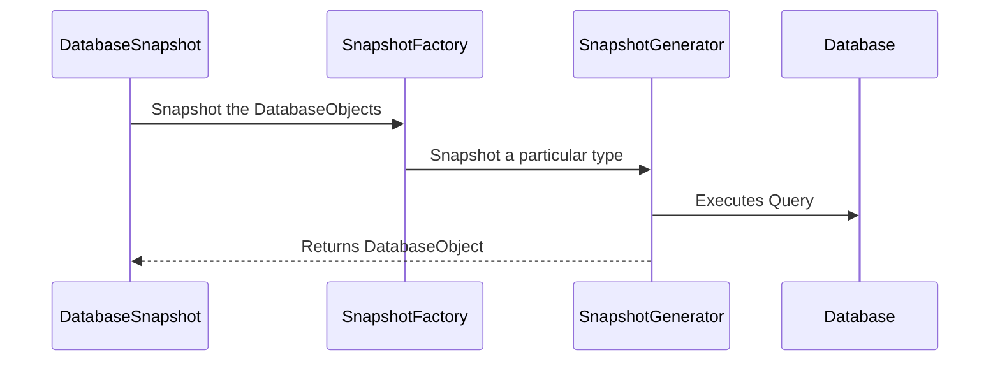

# Creating New Snapshot Generators

## Overview

`liquibase.snapshot.SnapshotGenerator` implementations define how to convert the "describe what you want to snapshot, not how to do it" requests 
into the driver calls and queries your database understands.

Liquibase defines a database-independent metadata model in [liquibase.snapshot.DatabaseSnapshot](https://javadocs.liquibase.com/liquibase-core/liquibase/snapshot/DatabaseSnapshot.html){:target="_blank"}.
That model contains standardized [liquibase.structure.DatabaseObject](https://javadocs.liquibase.com/liquibase-core/liquibase/structure/DatabaseObject.html){:target="_blank"} objects such as
[liquibase.structure.core.Table](https://javadocs.liquibase.com/liquibase-core/liquibase/structure/core/Table.html){:target="_blank"}.

The snapshot logic used in `liquibase snapshot`, `liquibase diff`, `liquibase diff-changelog`, and any other "check the current database structure" operations rely on `liquibase.snapshot.SnapshotGenerator`
implementations to read the database's metadata and create the corresponding `DatabaseObject` objects.

!!! tip

    The default SnapshotGenerators for a given DatabaseObject are named by adding "SnapshotGenerator" to the DatabaseObject's class name.
    For example, Column -> ColumnSnapshotGenerator.

    For SnapshotGenerators that handle specific environments, append a description of what makes it different to the end.
    For example, ColumnSnapshotGenerator -> ColumnSnapshotGeneratorOracle

## SnapshotGenerator Selection

Each `SnapshotGenerator` has a `getPriority()` method which the `SnapshotGeneratorFactory` uses to determine which implementation best snapshots a type for the given database.
Of all the supported `SnapshotGenerator` implementations, Liquibase will use the one with the highest [priority](../../references/priority.md).

## Prerequisites

Implementing support for additional databases requires an understanding of Java. You will be creating classes, overriding methods, and working with inheritance hierarchies.

## Project Setup

If you have not already created a repository to hold your code, see [Your First Extension](../../your-first-extension.md) in the Getting Started guide.

## Next Steps

When you are ready to create your new `SnapshotGenerator`, head to the [Create a SnapshotGenerator](create.md) page.