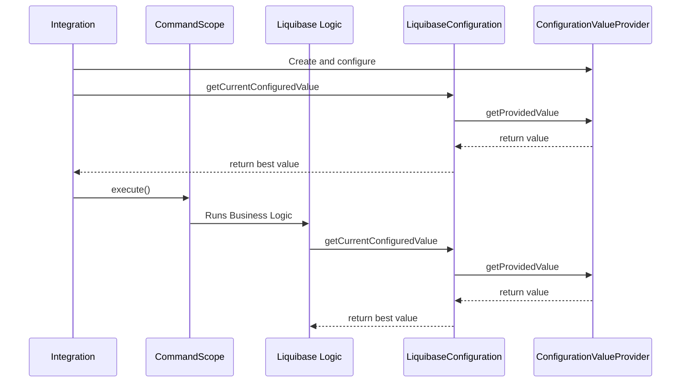

# Configuration API

The configuration API in the `liquibase.configuration` package provides both the facade for reading configuration settings regardless of where they come from 
and the way to define all the ways settings can be read.
The API provides both a way to look-up individual configuration values and metadata about each available configuration including human-readable descriptions.

The available configuration options are a pluggable extension point, and the configuration API provides a consistent and stable way to work with the configurations regardless of what extensions are installed.




## Configuring ConfigurationValueProviders

When code needs to access a global configuration value or a command argument value, it looks it up via the registered 
[liquibase.configuration.ConfigurationValueProvider](https://javadocs.liquibase.com/liquibase-core/liquibase/configuration/ConfigurationValueProvider.html){:target="_blank"} instances.

Each `ConfigurationValueProvider` has a "precedence" and the value returned from the provider with the highest precedence is the one that will be used.
This allows the user, for example, to have a `liquibase.outputFileEncoding` or `liquibase.command.update.url` value defined as an environment variable and a "better" version defined as a CLI argument.

By default, Liquibase will register a set of default value providers, including:

- Java system properties
- Environment variables
- Objects on the `liquibase.Scope` object

but integrations will often want to configure others.

New value providers can be registered by constructing and configuring the ConfigurationValueProvider you need and then registering it.

```java
DefaultsFileValueProvider provider = new DefaultsFileValueProvider(
        inputStram, 
        "File path " + filePath
    );

Scope.getCurrentScope().getSingleton(LiquibaseConfiguration.class)
        .registerProvider(provider);
```

If your integration needs to define its own custom value provider, see [the ConfigurationValueProvider guide](../Extension Guides/add-a-configuration-value-provider/index.md)  

!!! tip
    
    You can configure additional value providers based on settings read from the ones currently configured. 

    For example, the CLI configures the CLI argument and environment variable value providers before looking for a `liquibase.defaultsFile` 
    value in them to know how to configure the `DefaultValuesValueProvider`.

## Reading Configuration Values

Your integration will often have settings of its own, and these should be looked up via the configuration system to take advantage of the "cascading" value providers users expect to use.

For example, you should respect the `liquibase.outputFileEncoding` global configuration, supporting it being set via environment variables, a defaultsFile, and/or other locations.

Configuration values are best read via the `getCurrentValue()` method on [liquibase.configuration.ConfigurationDefinition](https://javadocs.liquibase.com/liquibase-core/liquibase/configuration/ConfigurationDefinition.html){:target="_blank"}
constants. You will find the `ConfigurationDefinition` instances defined on holder classes such as [liquibase.GlobalConfiguration](https://javadocs.liquibase.com/liquibase-core/liquibase/GlobalConfiguration.html){:target="_blank"}.
The `ConfigurationDefinition.getCurrentValue()` method provides type safety and standardized value handling logic, such as obfuscators to use when logging values.

```java
String encoding = GlobalConfiguration.OUTPUT_FILE_ENCODING.getCurrentValue();
```

If you do not have a ConfigurationDefinition to use, you can read arbitrary configuration values via the [liquibase.configuration.LiquibaseConfiguration](https://javadocs.liquibase.com/liquibase-core/liquibase/configuration/LiquibaseConfiguration.html){:target="_blank"}
singleton's `getCurrentConfiguredValue(...)` methods. 

## Custom ConfigurationDefinitions

If your integration exposes configuration settings of its own, you should define them with ConfigurationDefinitions. 
This allows you to take advantage of the type safety and centralized value handling logic, plus exposes them through the configuration metadata like all other configuration settings.

To define custom configuration definitions, create a new "holder" class such as `ExampleIntegrationConfiguration` with public static `ConfigurationDefinitions` as needed which are set up within the `static` initialization block.

```java
package com.example;

import liquibase.configuration.ConfigurationDefinition;
import liquibase.configuration.ConfigurationValueConverter;

public class ExampleIntegrationConfiguration {

    public static final ConfigurationDefinition<String> LOG_FILE;
    public static final ConfigurationDefinition<Boolean> SHOULD_RUN;

    static {
        ConfigurationDefinition.Builder builder = new ConfigurationDefinition.Builder("example");

        LOG_FILE = builder.define("logFile", String.class).build();

        SHOULD_RUN = builder.define("shouldRun", Boolean.class)
                .setDescription("Should Liquibase commands execute")
                .setDefaultValue(true)
                .addAliasKey("should.run")
                .build();
   }
}

```

