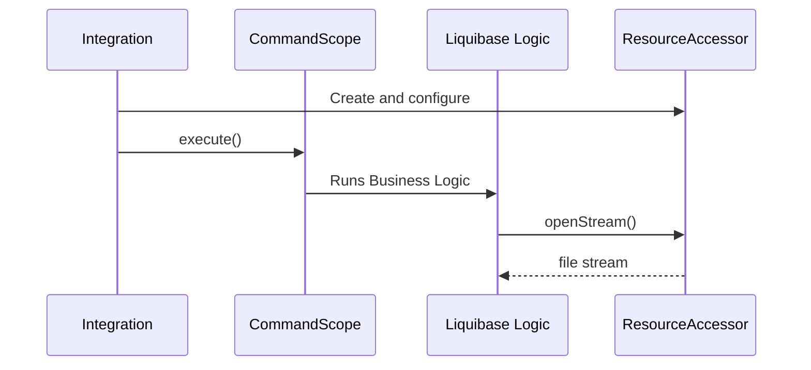

# Resource Accessor API

The resource accessor API in the `liquibase.resource` package provides an abstraction around how changelog-related files are looked up and read. 
That abstraction allows the file references encoded into changelog files to be usable across a wide range of environments without changes.

The ResourceAccessor API is exposed to end users as the "Search Path"

Each integration needs to configure the `ResourceAccessor` and set it in the `liquibase.Scope`

!!! example

    A changelog file may "include" a "com/example/child.changelog.xml" file, or have a `<sqlFile>` tag with a path of "custom_proc.sql". 
    That same changelog file may be run:

    - Via a CLI on Windows-based developer machines which each have their project directories stored in different locations
    - Via Maven on a Linux build server
    - Via Spring, reading the files from pre-built jar files




## Configuring the ResourceAccessor

Liquibase ships with some standard/common ResourceAccessor implementations including:

- `liquibase.resource.DirectoryResourceAccessor` for reading files from the filesystem
- `liquibase.resource.ClassLoaderResourceAccessor` for reading files from the Java classpath
- `liquibase.resource.ZipResourceAccessor` for reading files from a zip or jar file

Liquibase also includes a `liquibase.resource.SearchPathResourceAccessor` which allows you to easily combine the `liquibase.searchPath` configuration setting with custom ResourceAccessors.

For example:

```java
Scope.child(Scope.Attr.resourceAccessor, new SearchPathResourceAccessor(), () -> {
    //Code in this lambda will use the new ResourceAccessor
});
```

will automatically create ResourceAccessors for each element in the `liquibase.searchPath` configuration setting at the point the `new SearchPathResourceAccessor()` constructor was called.

If there are additional ResourceAccessors you would like included regardless of the configured `liquibase.searchPath`, you can pass them along in the constructor like this:

```java
CompositeResourceAccessor resourceAccessor = new SearchPathResourceAccessor(
        new DirectoryResourceAccessor(projectHome),
        new ZipResourceAccessor(Paths.get("/tmp/optional.zip"))
);

Scope.child(Scope.Attr.resourceAccessor, resourceAccessor, () -> {
    //Code in this lambda will use the new ResourceAccessor
});
```

## Custom ResourceAccessors

If your integration needs to define its own custom value provider, see [the ResourceAccessor guide](../guides/resource-accessors/index.md)