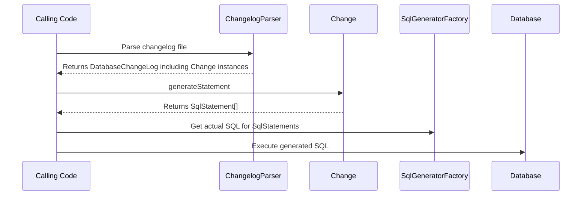

# liquibase.change.Change

## Overview

`liquibase.change.Change` implementations define what logic can be called from `changeSet` blocks in changelog files. 
Think of them as higher-level functions that shield users from needing to know the details of what it takes to perform a change.  

Liquibase ships with a large number of standard changes such as:

- createTable
- addColumn
- dropView
- introduceLookupTable
- etc.

but extensions can provide **_any_** functionality desired.  

Each Change generates a series of SqlStatements from the given input arguments. 

!!! tip

    `Change` instances define what "change functions" are available to the end-user and the arguments they take. 
    They should only deal with database-agnostic `SqlStatement` and not directly interact with the database.     

    See [the SqlGenerator API](sqlgenerator-sqlgenerator.md) for more information on SqlStatements and SqlGenerators.

## Change Selection

Each `Change` has a "name", and the ChangeLogParser selects the correct implementation by matching the name in the changelog file with the names defined by Change implementations.

To determine which `Change` to use, Liquibase will find all the implementations that use the given name and choose the one with the highest [priority](../architecture/service-discovery.md).
This allows extensions to either define a new Change OR override an existing Change with a given name.

## API Highlights

### Auto-Registration

Changes are [dynamically discovered](../architecture/service-discovery.md), so must have a no-arg constructor and be registered in `META-INF/services/liquibase.change.Change`. 

### generateStatements()

Returns an array of [liquibase.statement.SqlStatement](sqlgenerator-sqlgenerator.md)
which describes the steps to perform against the database when this change is run during an `update`.

### getConformationMessage()

Returns the message to output when this change executes successfully.

### Change Metadata

The AbstractChange base class's `createChangeMetaData()` method will configure the Change's metadata based on a [liquibase.change.DatabaseChange](https://javadocs.liquibase.com/liquibase-core/liquibase/change/DatabaseChange.html) annotation
on the Change class.

This annotation is required, and requires the following attributes to be set:

- `name` is the name used in the changelog file. Example: `createTable`
- `priority` is used as other [priority](../architecture/service-discovery.md) values to control which Change implementation for a given name should be used. If unsure, use `ChangeMetaData.PRIORITY_DEFAULT`
- `description` gives a human-readable description of what the change does

### Define Configuration Attributes

If a Change requires custom attributes to be set (tableName, etc.), create get/set methods for them.

The AbstractChange base class's `createChangeMetaData()` method will find all get/set method pairs and expose them as attributes on the change.

To control the metadata, methods can be given the [liquibase.change.DatabaseChangeProperty](https://javadocs.liquibase.com/liquibase-core/liquibase/change/DatabaseChangeProperty.html) annotation.
This annotation can be used to control the name, mark a get/set method as not actually a property, and more.

### Define Rollback Logic

Change implementations can override `createInverse()` or `generateRollbackStatements()` to provide auto-rollback support.

The `createInverse` method specifies rollback by defining it as another Change instance, while `generateRollbackStatements` returns SqlStatement objects to rollback. Only one or the other method needs to be implemented.

If this method is not overridden, users must specify the rollback logic themselves in their changelog file.

## API Details

The complete javadocs for `liquibase.change.Change` [is available at https://javadocs.liquibase.com](https://javadocs.liquibase.com/liquibase-core/liquibase/change/Change.html){:target="_blank"}

## Extension Guides

The following guides provide relevant examples:

- [Add a Change Type](../../extensions-integrations/extension-guides/add-a-change-type.md)