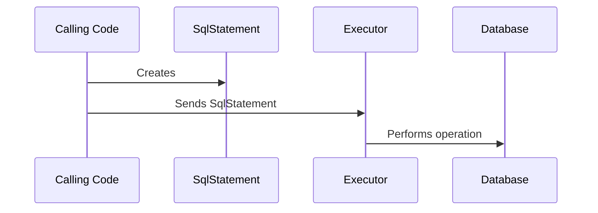

# executor.Executor Interface

## Overview

In order to run statements against your target database, Liquibase creates [liquibase.statement.SqlStatement](https://javadocs.liquibase.com/liquibase-core/liquibase/statement/SqlStatement.html){:target="_blank"}
objects describing the operation to perform. 

These could be more descriptive requests, like [liquibase.statement.core.CreateTableStatement](https://javadocs.liquibase.com/liquibase-core/liquibase/statement/core/CreateTableStatement.html){:target="_blank"} 
or one that simply specifies exactly what should be run like [liquibase.statement.core.RawSqlStatement](https://javadocs.liquibase.com/liquibase-core/liquibase/statement/core/RawSqlStatement.html){:target="_blank"}.

However, the SqlStatement only describes the operation to perform -- it is up to the [liquibase.executor.Executor](https://javadocs.liquibase.com/liquibase-core/liquibase/executor/Executor.html){:target="_blank"}
to know how to run that statement against the database.

The default `Executor` is [liquibase.executor.jvm.JdbcExecutor](https://javadocs.liquibase.com/liquibase-core/liquibase/executor/jvm/JdbcExecutor.html){:target="_blank"} 
which converts the `SqlStatements` to SQL and sends them to the database through the JDBC driver.

However, extensions can plug in any other database interactions needed. For example, you could send the desired SQL through an external CLI instead. 

## Executor Selection

Each `Executor` has a "name", and the calling code always sends each `SqlStatement` to a particular executor name. By default, the executor name used is `jdbc`, but that can be overridden with the `runWith` attribute on `changeSet`.

To determine which `Executor` to use, Liquibase will find all the implementations that use the given name and choose the one with the highest [priority](../../extension-references/priority.md).
This allows extensions to either define a new name OR override an existing Executor with a given name.

## API Highlights

### Empty Constructor

Liquibase requires implementations to have an empty constructor.

### getName()

Returns the "name" of the executor to be used, as described in [the overview](index.md) under "Executor Selection".

Names should be lowercase with no spaces or special characters.

### supports()

Return true if your executor can run statements against the given database. Only executors that return true from this method will be sorted by priority.

### getPriority()

Returns the priority of the executor, as described in [the overview](index.md) under "Executor Selection".

### validate()

If your executor has unique logic on what it can and cannot support in SqlStatements, validate them in this function. The default implementation does no validation.

### updatesDatabase()

If your executor does not actually apply changes to the database return `false`. This is used to determine if the current state of the database can be trusted in preconditions during `update` operations.

### execute()

These methods are where the real logic for running the `SqlStatements` go.
You can rely on `liquibase.sqlgenerator.SqlGeneratorFactory` to generate SQL from the `SqlStatements` if that is something your Executor requires.
Make sure you take the `sqlVistor` list into account.

!!! tip
The two `execute` methods differ only in the arguments, so you can generally call the version that takes a `List<SqlVisitor>` from the other.

### comment

Generally your executor doesn't have to care about comments because they don't impact your database. Simply sending the comment to FINE level logs is all you normally need to do.

### query and update methods

**_ALL_** database operations in Liquibase go through an executor, not just changeSets. To support all the needed database interactions, the `Executor` interface includes a set of
methods that are only called against Executors with the name "jdbc":

- query* methods
- update*

If you are creating an extension purely for use in changeSets with `runWith`, you can `throw new UnsupportedOperationException()` from all these methods.

### Registration

Change classes are registered by adding it to  `META-INF/services/liquibase.executor.Executor`

## API Details

The complete javadocs for `liquibase.executor.Executor` [is available at https://javadocs.liquibase.com](https://javadocs.liquibase.com/liquibase-core/liquibase/executor/Executor.html){:target="_blank"}
