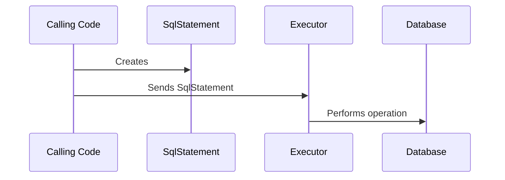

# liquibase.executor.Executor

## Overview

In order to run statements against your target database, Liquibase creates [liquibase.statement.SqlStatement](https://javadocs.liquibase.com/liquibase-core/liquibase/statement/SqlStatement.html){:target="_blank"}
objects describing the operation to perform. 

These could be more declarative requests, like [liquibase.statement.core.CreateTableStatement](https://javadocs.liquibase.com/liquibase-core/liquibase/statement/core/CreateTableStatement.html){:target="_blank"} 
or one that simply specifies exactly what should be run like [liquibase.statement.core.RawSqlStatement](https://javadocs.liquibase.com/liquibase-core/liquibase/statement/core/RawSqlStatement.html){:target="_blank"}.

However, the SqlStatement only describes the operation to perform -- it is up to the [liquibase.executor.Executor](https://javadocs.liquibase.com/liquibase-core/liquibase/executor/Executor.html){:target="_blank"}
to know how to run that statement against the database.

The default `Executor` is [liquibase.executor.jvm.JdbcExecutor](https://javadocs.liquibase.com/liquibase-core/liquibase/executor/jvm/JdbcExecutor.html){:target="_blank"} 
which converts the `SqlStatements` to SQL and sends them to the database through the JDBC driver.

However, other implementations perform other database interactions instead. For example, you could send the desired SQL through an external CLI instead, or simply log the SQL without executing it. 

## Executor Selection

Each `Executor` has a "name", and the calling code always sends each `SqlStatement` to a particular executor name. By default, the executor name used is `jdbc`, but that can be overridden in code or with the `runWith` attribute on `changeSet`.

To determine which `Executor` to use, Liquibase will find all the implementations that use the given name and [supports](#supports--) the given database, then chooses the one with the highest [priority](../architecture/service-discovery.md).
This allows extensions to either define a new name OR override an existing Executor with a given name.

## API Highlights

### Auto-Registration

Changes are [dynamically discovered](../architecture/service-discovery.md), so must have a no-arg constructor and be registered in the `META-INF/services/liquibase.executor.Executor` file.

### getName()

Returns the "name" of the executor to be used when [selecting the instance to use](#executor-selection).

Names should be lowercase with no spaces or special characters.

### supports()

Used in [selecting the instance to use](#executor-selection

### getPriority()

Used in [selecting the instance to use](#executor-selection

### validate()

Allows the executor to verify whether it supports the given SqlStatement and/or its configuration.

### updatesDatabase()

Returns `false` if the executor does not actually update the database. This is used to determine if the current state of the database can be trusted in preconditions during `update` operations.

### Execute methods

These methods are where the logic for running the `SqlStatements` go.

Executors that deal with SQL rely on [liquibase.sqlgenerator.SqlGeneratorFactory](sqlgenerator-sqlgenerator.md) to generate SQL from the `SqlStatements`.

### Query and update methods

**_ALL_** database operations in Liquibase go through an executor, not just changeSets. To support all the needed database interactions, the `Executor` interface includes a set of
methods that are only called against Executors with the name "jdbc":

- query* methods
- update*

Non-"jdbc" executors will throw UnsupportedOperationException from all these methods.

### comment

Comments can be sent to the executor to describe what is being run. Most executors ignore them, but ones that log what would have been executed may want to log the comments as well.

## API Details

The complete javadocs for `liquibase.executor.Executor` [is available at https://javadocs.liquibase.com](https://javadocs.liquibase.com/liquibase-core/liquibase/executor/Executor.html){:target="_blank"}

## Extension Guides

The following guides provide relevant examples:

- [Add a Native Executor](../../extensions-integrations/extension-guides/add-a-native-executor.md)