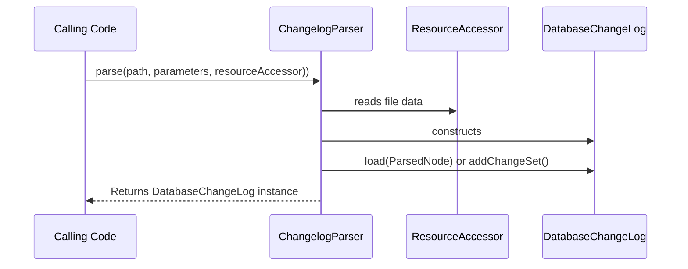

# liquibase.parser.ChangeLogParser Interface

## Overview

`liquibase.parser.ChangeLogParser` implementations define the changelog file formats Liquibase understands.  

The job of the parser is to read an input stream and create a [liquibase.changelog.DatabaseChangeLog](https://javadocs.liquibase.com/liquibase-core/liquibase/changelog/DatabaseChangeLog.html){:target="_blank"} out of it.

For changelog formats that are different ways of formatting the same structure used in xml/yaml/json changelogs, `liquibase.parser.core.ParsedNode` acts as an intermediate format that can be passed to DatabaseChangeLog's `load()` method.
For changelog formats that are more custom, the various `add` methods on DatabaseChangeLog can be called directly to configure it based on the contents of the source file before returning it.

## Parser Selection

Each `ChangeLogParser` has a `supports()` method which determines if it can parse the given file. 

To determine which supported `ChangeLogParser` to use, Liquibase will find all the implementations that use the given name and choose the one with the highest [priority](../../extensions-integrations/extension-references/priority.md).
This allows extensions to either define a new format OR override an existing parser.

## API Highlights

### Empty Constructor

Liquibase requires implementations to have an empty constructor.

### supports()

The supports method is passed the name of the file and the `ResourceAccessor` to look the file up in.

Often the file extension is enough to know whether the parser will support the file or not, so there is no need to read the contents from the resource accessor.
However, the resource accessor is there if the actual contents of the file is needed to determine whether the parser is correct or not.

### getPriority()

Returns the priority of the parser, as described in [the overview](../../../code/api/parser-changelogparser.md) under "Parser Selection".
Only parsers that return `true` from the `supports` function will have their priority compared.

### parse()

This is the method that is called to convert the given path to a parsed [liquibase.changelog.DatabaseChangeLog](https://javadocs.liquibase.com/liquibase-core/liquibase/changelog/DatabaseChangeLog.html).

There are two ways to populate the DatabaseChangeLog object once it is created: using ParsedNodes or manually configuring it.

#### Parsed Nodes

To simplify parser implementations that are providing a different way of structuring a standard changelog file, you can use a [liquibase.parser.core.ParsedNode](https://javadocs.liquibase.com/liquibase-core/liquibase/parser/core/ParsedNode.html){:target="_blank"}.
The ParsedNode structure is a format-neutral way to describe nested nodes of a changelog file, where each node can have attributes and/or values.

For example, the XML, YAML, and JSON parser read their respective formats and create a ParsedNode structure out of them, then pass that to the `DatabaseChangeLog.load()` function.
The load() function has all the logic for building ChangeSets, Changes, Preconditions, including files, etc. based on the ParsedNodes. This keeps the functionality and format consistent between all these formats.

#### Manual Configuration

For formats that are not mirrors of the XML/YAML/JSON structure, the `DatabaseChangeLog` object has methods such as

- addChangeSet()
- include()
- includeAll()

which can be called as needed based on what is in the file.

## Registration

ChangeLogParser classes are registered by adding it to `META-INF/services/liquibase.parser.ChangeLogParser`

## API Details

The complete javadocs for `liquibase.parser.ChangeLogParser` [is available at https://javadocs.liquibase.com](https://javadocs.liquibase.com/liquibase-core/liquibase/parser/ChangeLogParser.html){:target="_blank"}
