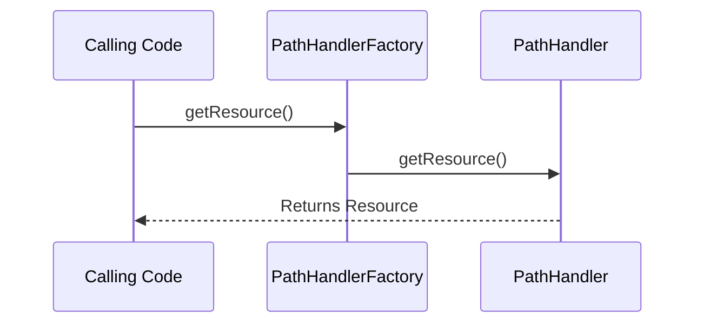

# liquibase.resource.PathHandler Interface

## Overview

`liquibase.resource.PathHandler` implementations allow Liquibase to read files from different physical locations. 

They differ from [ResourceAccessors](../add-a-resource-accessor/index.md) in that `ResourceAccesors` are used for looking up file references within changelogs, 
whereas `PathHandlers` are used to look up files referenced outside changelogs. 

!!! note

    `PathHandler` implementations can construct ResourceAccessors. This allows new the file lookup logic provided by custom PathHandlers to be used
    in the `liquibase.searchPath` setting.  

Liquibase ships with [liquibase.resource.DirectoryPathHandler](https://javadocs.liquibase.com/liquibase-core/liquibase/resource/DirectoryPathHandler.html){:target="_blank"}
which looks up paths without a protocol as a relative or absolute file paths. Any custom PathHandlers should generally recognize paths they handle through an expected URL-like protocol, such as `ftp://example.com/my/file.sql`. 

## PathHandler Selection

Each `PathHandler` defines a `getPriority(path)` method which returns the [priority](../../extension-references/priority.md) for handling that particular path.
`PathHandlerFactory` will use the `PathHandler` that returns the highest priority value.
This allows extensions to either define a new way to look up files OR override existing logic.

## API Highlights

### Empty Constructor

Liquibase requires implementations to have an empty constructor.

### getPriority()

Returns where the path handler falls in the hierarchy, as described in [the PathHandler overview](#pathhandler-selection).

### getResource()

Looks up the given resource and returns it. This method should return a resource even if it does not exist, with callers using the `Resource.exists()` method as needed.

### createResource()

Creates a new resource at the given path and returns a stream for writing to it.

If a file already exists at that location, a `java.nio.file.FileAlreadyExistsException` exception should be thrown.

### getResourceAccessor()

Constructs a [ResourceAccessor](../add-a-resource-accessor/index.md) for the given path.

Because ResourceAccessors are used to look up files, the passed path should be a directory or some other "multiple-file" type location such as a zip file.

### Registration

Implementation classes are registered by adding it to `META-INF/services/liquibase.resource.PathHandler`

## API Details

The complete javadocs for `liquibase.resource.PathHandler` [is available at https://javadocs.liquibase.com](https://javadocs.liquibase.com/liquibase-core/liquibase/resource/PathHandler.html){:target="_blank"}
