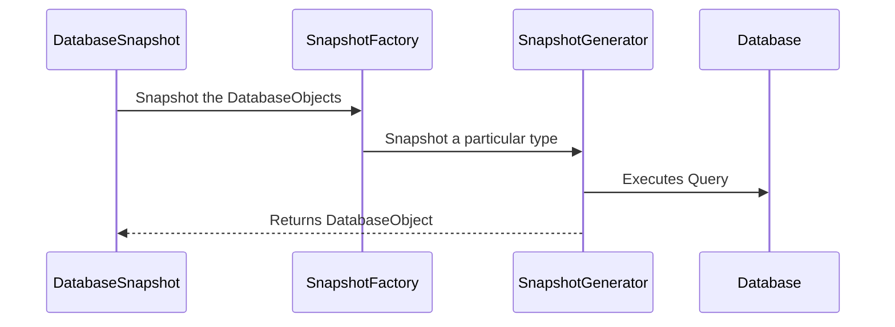

# liquibase.snapshot.SnapshotGenerator

## Overview

`liquibase.snapshot.SnapshotGenerator` implementations define how to convert the "describe what you want to snapshot, not how to do it" requests 
into the driver calls and queries your database understands.

Liquibase defines a database-independent metadata model in [liquibase.snapshot.DatabaseSnapshot](https://javadocs.liquibase.com/liquibase-core/liquibase/snapshot/DatabaseSnapshot.html){:target="_blank"}.
That model contains standardized [liquibase.structure.DatabaseObject](https://javadocs.liquibase.com/liquibase-core/liquibase/structure/DatabaseObject.html){:target="_blank"} objects such as
[liquibase.structure.core.Table](https://javadocs.liquibase.com/liquibase-core/liquibase/structure/core/Table.html){:target="_blank"}.

The snapshot logic used in `liquibase snapshot`, `liquibase diff`, `liquibase diff-changelog`, and any other "check the current database structure" operations rely on `liquibase.snapshot.SnapshotGenerator`
implementations to read the database's metadata and create the corresponding `DatabaseObject` objects.



!!! tip

    The default SnapshotGenerators for a given DatabaseObject are named by adding "SnapshotGenerator" to the DatabaseObject's class name.
    For example, Column -> ColumnSnapshotGenerator.

    For SnapshotGenerators that handle specific environments, append a description of what makes it different to the end.
    For example, ColumnSnapshotGenerator -> ColumnSnapshotGeneratorOracle


## SnapshotGenerator Selection

The `getPriority` logic works a bit different from other interfaces in that it's not used to choose the single "best" implementation to use, but rather to choose the **_order_** to run SnapshotGenerators in.

Like other getPriority methods, if the implementation does not apply to the given type/database combination, it should return `liquibase.snapshot.PRIORITY_NONE`.

However, Liquibase will use ALL instances that return a priority > 0 to snapshot an object.
Therefore, if an implementation is replacing a base SnapshotGenerator it must override the `replaces()` function rather than returning a higher value from `getPriority()`.
The `replaces()` function lets it define "use this class in the snapshot logic instead of another one".

A good example implementation for a class that replaces the default ColumnSnapshotGenerator is

```java
    @Override
    public int getPriority(Class<? extends DatabaseObject> objectType, Database database) {
        if (database instanceof ExampleDatabase) {
            return super.getPriority(objectType, database);
        } else {
            return PRIORITY_NONE;
        }
    }

    @Override
    public Class<? extends SnapshotGenerator>[] replaces() {
        return new Class[] {
                ColumnSnapshotGenerator.class
        };
    }
```

which relies on the superclass's "should I be part of the snapshot process for the given type" logic but only for ExampleDatabase while also taking the place of ColumnSnapshotGenerator when it's used.

## API Highlights

### Auto-Registration

SnapshotGenerators are [dynamically discovered](../architecture/service-discovery.md), so must have a no-arg constructor and be registered in the `META-INF/services/liquibase.snapshot.SnapshotGenerator` file.

### getPriority and replaces

Used in [selecting the instance(s) to use](#snapshotgenerator-selection)

### snapshot()

This is the method that is called by the snapshot system to either look up the information about the given `example` object, OR add additional information to it.
Multiple SnapshotGenerator instances will work together to build up the final snapshot of the object.

The overall flow is:

_1. The calling code defines the "example" object it wants._

!!! example

    If they want to snapshot a Table with the name "address" they construct a `liquibase.structure.core.Table` object and set the name to "address". 
    To look up the table in a different schema, they set the schema attribute on Table to the desired schema.
    The "example" object will contain the fields set that should be used to identify the actual object to snapshot. 

_2. The snapshot system will collect all the SnapshotGenerators that say they should participate in the snapshot and call the `snapshot` method in `getPriority()` order._

!!! example

    When snapshotting an example Table, the `TableSnapshotGenerator.snapshot()` call will run first which captures the table name, schema, etc.  
    Then the ColumnSnapshotGenerator.snapshot() will run which snapshots all the columns associated with the table and adds those columns to the Table object.

_3. After all the SnapshotGenerators have added their information to the Table object, it's returned to the calling code._


## API Details

The complete javadocs for `liquibase.snapshot.SnapshotGenerator` [is available at https://javadocs.liquibase.com](https://javadocs.liquibase.com/liquibase-core/liquibase/snapshot/SnapshotGenerator.html){:target="_blank"}

## Extension Guides

The following guides provide relevant examples:

- [Add a Snapshot Generator](../../extensions-integrations/extension-guides/add-a-snapshot-generator.md)
