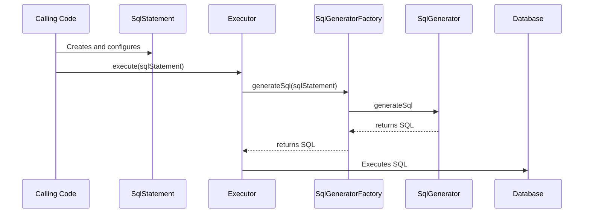

# liquibase.sqlgenerator.SqlGenerator

## Overview

`liquibase.statement.SqlStatement` implementations define specific operations that can be run against a database, such as 
`liquibase.statement.core.CreateTableStatement` or `liquibase.statement.core.DropColumnStatement`. 
However, they only define the **_what_**, not the **_how_**. 

It is the job of the `liquibase.sqlgenerator.SqlGenerator` implementations to know how to actually apply those operations to a given database.

For more information on change types, see the [change types guide](change-change.md).

!!! tip

    The default SqlGenerators for a given SqlStatement are named by replacing "Statement" from the class name with "Generator".
    For example, CreateTableStatement -> CreateTableGenerator.

    For SqlGenerators that handle specific environments, append a description of what makes it different to the end.
    For example, CreateTableStatement -> CreateTableGeneratorOracle

!!! example

    When parsing a changelog file, Liquibase creates a `CreateTableChange` object with the table name and column definitions specified in the changelog file.
    When the Change is "executed", it will first create a `CreateTableStatement` object containing the same information and pass that to the `Executor`. 
    Liquibase will then go through all the available `SqlGenerators` that say they support `CreateTableStatement` for the given database and use the one with the
    highest priority to come up with the actual SQL to run to create the table.

## SqlGenerator Selection

Each `SqlGenerator` has a `supports()` method which the `SqlGeneratorFactory` uses to determine which implementations can apply the SqlStatement to the given database.

Of all the supported `SqlGenerator` implementations, Liquibase will use the one with the highest [priority](../architecture/service-discovery.md).
This allows extensions to either define a default logic for a SqlStatement OR override other SqlGenerators with a better implementation.

## API Highlights

### Auto-Registration

SqlGenerators are [dynamically discovered](../architecture/service-discovery.md), so must have a no-arg constructor and be registered in `META-INF/services/liquibase.sqlgenerator.SqlGenerator`.

### supports()

This method returns whether your SqlGenerator can be used for the given SqlStatement and Database.

Since SqlGenerator classes should be defined using generics, Liquibase will know the SqlStatement types it supports and not have to rely on supports() unless the SqlStatement class is correct.
Therefore, this method generally only has to check that the Database object is correct.

!!! warning

    Do not return `true` for SqlStatements the generator logic cannot handle. 

    The default implementation from `AbstractSqlGenerator` returns `true`, which is too broad for database-specific SqlGenerator implementations

### getPriority()

Used in [selecting the instance to use](#sqlgenerator-selection).

Returns `PRIORITY_DEFAULT` for default/standard logic and `PRIORITY_DATABASE` for logic unique to a database.

### generateSql()

Returns the SQL to run as [liquibase.sql.Sql](https://javadocs.liquibase.com/liquibase-core/liquibase/sql/Sql.html){:target="_blank"} objects.

The normal class to use for those `Sql` objects is `liquibase.sql.UnparsedSql`.

This function returns an array of Sql statements because a single logical statement may require multiple SQL statements in some databases.
For example, `AddPrimaryKeyGenerator` may return a SQL call to add the primary key and another to reorganize the table.

!!! tip

    **When extending an existing SqlGenerator**

    Depending on how different the SQL is from the base class, either call `super.generateSql()` and modify the objects in the array before returning it, 
    OR create a new `Sql[]` array from scratch. 

    It tends to be best to modify the SQL generated by the parent class because that avoids having to duplicate all the
    argument-handling logic that already exists in the parent. One approach is to call `super.generateSql()` and then create new `UnparsedSql` objects 
    using the `originalSql.toSql()` value passed through string replacements. 

!!! warning

    When creating SQL, object names must be wrapped in `database.escape...()` calls to correctly handle reserved words 
    and `database.escapeStringForDatabase()` around any string literals to handle special characters like `'` inside them.  

### validate() and warn()

Called to validate whether the SqlStatement is correctly configured. For example, if the logic requires the tableName to be set, add that to the `ValidationErrors` that are returned.

This method is always called, so you do not need to re-validate configuration in other methods.

If there is no additional validation to perform vs. the base logic there is no need to override this method.

The `warn(SqlStatement, Database, SqlGeneratorChange)` method is similar to validate but returns non-fatal warnings to the user.

!!! tip

    When extending a base SqlGenerator, call `super.validate(statement, database, sqlGeneratorChain)` as a starting point, 
    then perform extra checks (or remove not-actually-invalid errors) before returning the [ValidationErrors](https://javadocs.liquibase.com/liquibase-core/liquibase/exception/ValidationErrors.html){:target="_blank"}.

### generateStatementsIsVolatile()

Ideally, the logic should be able to generate the correct SQL purely from the information stored in the SqlStatement object.

However, if that information is incomplete and the logic must check the database state or other external environments, this method must `true` to mark it as "volatile".
That lets Liquibase know that for commands such `updateSql`, it cannot rely on what your `generateSql` method returns because the internal database state is not actually correct.

## API Details

The complete javadocs for `liquibase.sqlgenerator.SqlGenerator` [is available at https://javadocs.liquibase.com](https://javadocs.liquibase.com/liquibase-core/liquibase/sqlgenerator/SqlGenerator.html){:target="_blank"}

## Extension Guides

The following guides provide relevant examples:

- [Add a SqlGenerator](../../extensions-integrations/extension-guides/add-a-sql-generator.md)