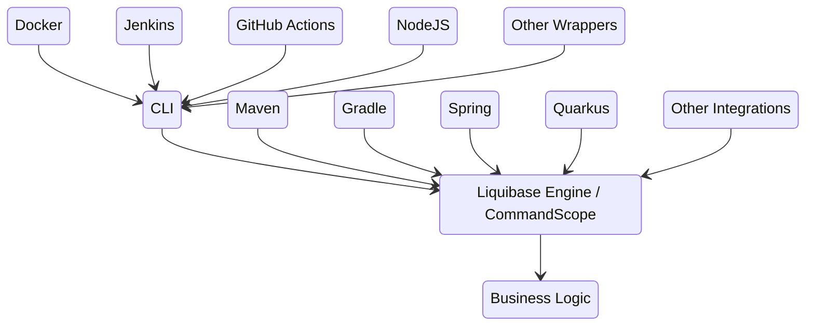
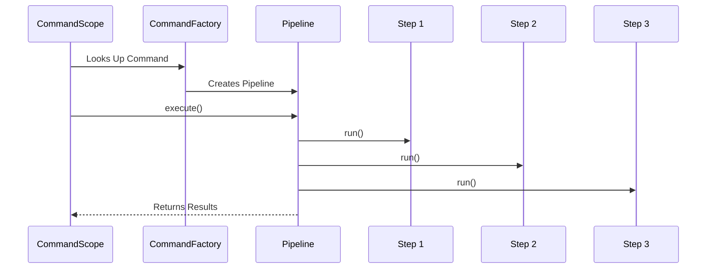
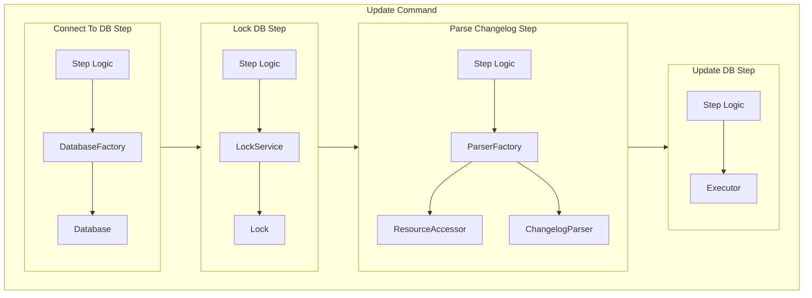
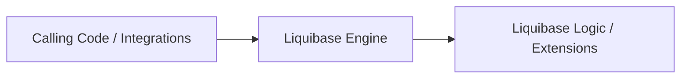

# Architecture Overview

## Integrations to Engine

End-user interactions with Liquibase always start with some sort of interface/front-end/"integration".
The different integrations allow Liquibase to cleanly fit into existing tools and workflows. 

Some integrations such as the CLI and Maven allow the user to execute any of the liquibase commands on demand. 
The Docker, NodeJS, and other integrations work the same way as they are simply adapting the CLI to a particular way of running it.  
Others, such as Spring and Quarkus embed Liquibase into application logic and automatically call Liquibase commands itself.

However, all integrations are simply wrappers around the core Liquibase engine. They translate the user's request into calls to the same underlying business logic.

## Liquibase Engine

The Primary Facade Class for the Liquibase Engine is [liquibase.command.CommandScope](../api/command-commandscope.md). Each integration will perform an initial setup, such as configuring applicable ConfigurationValueProviders and ResourceAccessors, 
and then execute the requested command through a `CommandScope` object. Internally, each command can be handled by any number of independent steps but that coordination is handled within the CommandScope call. 

## Business Logic

The logic within each CommandStep will call out to the other Liquibase APIs as needed. The commands are coded against the technology-agnostic service interfaces, so that the same business logic will be run regardless of the changelog format, database type, underlying OS, etc.

For example, the "update" command steps include: 

## Pluggable Implementations

[Liquibase's APIs](../api/index.md) are generally written to expose the "business logic" while hiding the underlying implementation. 

For example, the above "update" command is coded against the ChangelogParser interface which exposes a `parse()` method, but nothing about what the format is. When the code asks the parser to parse a file named `my/changelog.xml`, Liquibase will go through all the available implementations of `ChangeLogParser` [to find the version that "best" parses that file and will use that](service-discovery.md).

Liquibase ships with a standard set of implementations for each business logic service in `liquibase-core.jar` and external extensions can be written to provide additional implementations.
There are no code differences between what ships in `liquibase-core.jar` and what is provided by an extension. 

## Extensions and Integrations

The difference between [extensions](../../extensions-integrations/extensions-overview/index.md) and [integrations](../../extensions-integrations/integrations-overview/index.md) is whether they are changing the logic **_within_** Liquibase or whether they are **_controlling_** how that logic is triggered.

Extensions allow new functionality to be added or existing functionality changed, and that functionality will consistently be run regardless of the integration.

Integrations allow the same Liquibase functionality to be embedded or driven in whatever ways work best for each user.

## Next Steps

Looking for more architecture details? Learn about [the code structure](code-structure.md) or dive into the [API details](../api/index.md).

Ready to contribute your changes? [Send us a pull request!](../get-started/create-pr.md)

## Need help?

Visit our [Developer forum](https://forum.liquibase.org/c/liquibase-development/){:target="_blank"} or reach
out [on Discord](https://discord.gg/pDB5DfE){target="_blank"}.

