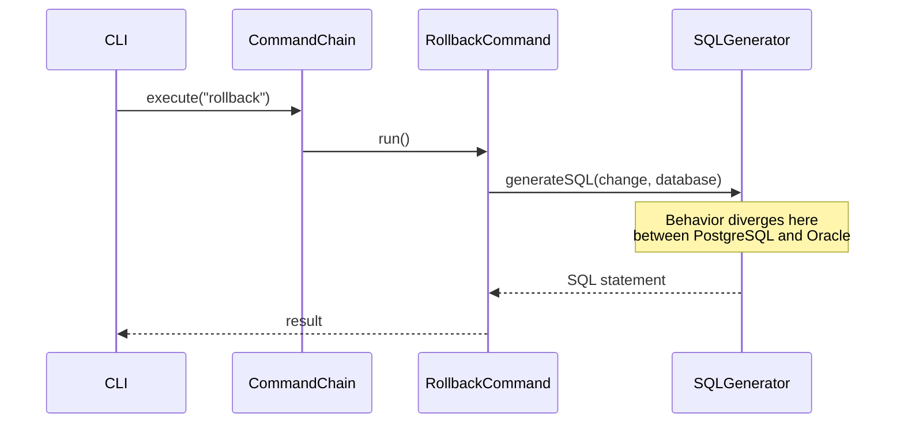

# Issue Resolution & Community Collaboration

## Every Contribution Matters

Liquibase is built by and for its community. Every bug report, analysis, code contribution, and test written makes Liquibase better for everyone. We are deeply grateful for the time and effort that contributors bring to this project — whether you have been here for years or this is your first interaction.

We also want to be honest and transparent with you about how the project works, so that we can collaborate more effectively together.

## Understanding Team Capacity

Like many open-source projects, the Liquibase engineering team balances a wide range of priorities. While we are committed to the health of the open-source project, our bandwidth to individually implement fixes for every reported issue is limited. This is not because we don't care — quite the opposite. It means we rely on, and deeply value, the community's help to keep the project moving forward.

The Liquibase team is committed to:

- Triaging issues and providing initial feedback
- Guiding community contributors who are working on a fix
- Reviewing analyses, pull requests, and test contributions
- Answering questions on issue threads and [Discord](https://discord.gg/pDB5DfE){:target="_blank"}
- Implementing fixes when team capacity and priorities allow, focusing on severity and community impact

The most effective way to get an issue resolved faster is community involvement — and there are many ways to contribute that do not require writing a full fix.

## How the Community Can Help

The difference between an issue that gets resolved quickly and one that sits for months often comes down to community engagement. Here are the highest-impact ways to move an issue forward:

### Provide a Detailed Analysis

Rather than just reporting a bug, investigate and document what is happening as precisely as you can. Even without a development background, a well-written analysis dramatically reduces the time needed to diagnose and fix an issue.

**For everyone:** Document the behavior in as much detail as possible:

- The exact inputs you provided (changelog, command, configuration)
- The exact output or error you received
- What you expected to happen instead
- Whether the behavior changes with different Liquibase versions, databases, or environments

**If you are familiar with the Liquibase codebase or Java development**, you can go deeper:

- **Which class, method, or module** is likely involved
- **What is happening vs. what should happen** at the code level
- **A sequence diagram** tracing the execution flow for the scenario that fails

Sequence diagrams are particularly valuable for understanding complex interactions. For example, if a `rollback` command behaves differently across two databases, a diagram tracing the call chain can pinpoint exactly where the paths diverge:

You do not need to be a developer to produce a useful diagram — even a hand-drawn flow of "I did X, then Y happened, but I expected Z" communicates valuable information. Documenting the flow and highlighting where things go wrong is a contribution on its own.

### Clarify the Scope of the Issue

When a bug is reported, it is often unclear whether it affects one database, several, or all of them. Sharing what you know — even if it is just your own experience — helps everyone understand how widespread the problem is and how urgently it should be addressed.

Here are some things worth sharing in an issue comment, based on whatever you happen to know or have access to:

- **If you have access to multiple database types**, try reproducing the issue on them and share what you find. For example: "I confirmed this also happens on MySQL — it is not just PostgreSQL."
- **If you have tried multiple Liquibase versions**, note whether the problem exists in all of them or only in a specific version. If it worked before and broke recently, that is a very useful signal.
- **If you use Liquibase in more than one way** (for example, both from the command line and via a Maven build), share whether the problem shows up in all of them or just one.
- **If you can describe how common the scenario is**, that helps too — for example, "this is a pattern many teams use" or "this is a very specific edge case in our setup."

None of these require a technical background — you are simply sharing your own experience. Even a brief comment like "I can only reproduce this with the CLI, not with Maven" is exactly the kind of information that shapes how a fix is approached.

### Perform a Risk Assessment

Before a fix is implemented, it helps to think about what else might be affected. This kind of reflection — often called a risk assessment — helps contributors make safer changes and helps reviewers approve them with more confidence. You do not need an engineering background to contribute here; some of the most useful input comes from people who simply know the product well.

**For everyone:** Think about and share what else in your workflow might be affected by a change. For example:

- Are there other commands or operations that do something similar and might be impacted?
- Have you seen related behavior elsewhere in Liquibase that a fix might accidentally change?
- Is this something many teams are likely to rely on, or a rare edge case?

Sharing those observations as a comment on the issue — even informally — is genuinely useful.

**If you are a Java developer**, you can extend the assessment to the code level:

- **Affected areas of code** — which classes, modules, or components would a fix need to touch?
- **Regression risk** — could changing this behavior break other scenarios? Which tests or use cases might be affected?
- **Changelog compatibility** — could the fix change how existing changelogs are interpreted or cause checksum differences?
- **Extension and API impact** — does the fix touch any public APIs or extension points that downstream projects depend on?

A risk assessment does not need to be exhaustive. Even a short note like "this seems to only affect snapshot generation for PostgreSQL and should not change behavior for other databases" gives meaningful guidance to anyone planning to implement or review the fix.

### Contribute Tests

One of the highest-value contributions you can make is helping ensure that a fix is well covered by tests — even if you never write a single line of code. Tests:

- **Document the bug** — a clear, reproducible case is proof the problem exists
- **Prevent regressions** — once a fix is in, tests ensure the problem does not silently come back
- **Accelerate review** — well-covered changes are easier to evaluate and merge with confidence

**For everyone:** Think about the scenarios that triggered the bug and describe them in the issue. What were you doing when it happened? What inputs, configurations, or sequences of steps were involved? Are there related scenarios that a fix should also handle correctly?

Sharing these use cases — even in plain language — is genuinely useful. A developer writing tests can use your scenarios directly as a checklist to make sure the fix is fully covered. For example:

> "This happens when `createTable` runs on a schema that already exists. It would also be worth checking: what happens if the table exists but with different columns? What if the schema name contains special characters?"

That kind of input shapes the test coverage even if you never open a code editor.

**If you are a Java developer**, consider writing the tests directly. Liquibase uses the [Spock testing framework](https://spockframework.org/){:target="_blank"} for both unit and integration tests. See our guides for:

- [Writing unit tests](test-your-code/unit-tests.md)
- [Writing integration tests](test-your-code/integration-tests.md)

!!! tip
    A pull request that only adds a failing test to demonstrate a bug — with no fix yet — is a welcome and valuable contribution. It reduces uncertainty for whoever picks up the fix next.

## What to Expect

We want to be transparent about realistic expectations when you open an issue or submit a contribution:

| Contribution | What to expect |
|---|---|
| **Bug report** | Triage and initial feedback; fix timeline depends on severity, impact, and community involvement |
| **Feature request** | Review and discussion; implementation depends on roadmap fit and community interest |
| **Issue analysis or scope report** | Reviewed and acknowledged; directly helps prioritize and accelerate a fix |
| **Risk assessment** | Reviewed as part of the issue discussion; aids both contributors and reviewers |
| **Pull request** | Initial review feedback, followed by a full review cycle (see [PR Review Process](get-started/create-pr.md#pr-review-process)) |
| **Test contribution** | Welcomed and reviewed; may be merged independently ahead of the full fix |

If you are waiting on an issue that is important to you, the most effective action is to contribute new information — a better reproduction case, an analysis, a scope report, a risk assessment, or an offer to help implement the fix.

## Getting Help

If you have questions about an issue or need guidance on contributing a fix, reach out:

- **GitHub issue comments** — for code-level questions and discussion directly tied to a specific issue
- **[Discord](https://discord.gg/pDB5DfE){:target="_blank"}** — join the Liquibase server for real-time conversation with team members and the broader community

Thank you for being part of the Liquibase community. Every contribution — no matter how small — helps make Liquibase better for everyone.