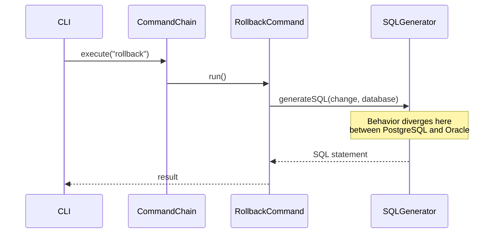

# Issue Resolution & Community Collaboration

## Every Contribution Matters

Liquibase is built by and for its community. Every bug report, analysis, code contribution, and test written makes Liquibase better for everyone. We are deeply grateful for the time and effort that contributors bring to this project — whether you have been here for years or this is your first interaction.

We also want to be honest and transparent with you about how the project works, so that we can collaborate more effectively together.

## Understanding Team Capacity

Like many open-source projects, the Liquibase engineering team balances a wide range of priorities. While we are committed to the health of the open-source project, our bandwidth to individually implement fixes for every reported issue is limited. This is not because we don't care — quite the opposite. It means we rely on, and deeply value, the community's help to keep the project moving forward.

The Liquibase team is committed to:

- Triaging issues and providing initial feedback
- Guiding community contributors who are working on a fix
- Reviewing analyses, pull requests, and test contributions
- Answering questions on issue threads and [Discord](https://discord.gg/pDB5DfE){:target="_blank"}
- Implementing fixes when team capacity and priorities allow, focusing on severity and community impact

The most effective way to get an issue resolved faster is community involvement — and there are many ways to contribute that do not require writing a full fix.

## How the Community Can Help

The difference between an issue that gets resolved quickly and one that sits for months often comes down to community engagement. Here are the highest-impact ways to move an issue forward:

### Provide a Detailed Analysis

Rather than just reporting a bug, investigate and document where in the codebase the problem might be. This dramatically reduces the time anyone needs to implement a fix.

A useful analysis might include:

- **Which class, method, or module** is likely involved
- **What is happening vs. what should happen** at the code level
- **A sequence diagram** tracing the execution flow for the scenario that fails

Sequence diagrams are particularly valuable for understanding complex interactions. For example, if a `rollback` command behaves differently across two databases, a diagram tracing the call chain can pinpoint exactly where the paths diverge:

You do not need to be a core contributor to produce a useful diagram. Documenting the flow and highlighting where things go wrong is a valuable contribution on its own.

### Clarify the Scope of the Issue

When a bug is reported, it is often unclear whether it affects one database, several, or all of them. Clarifying the scope helps everyone understand the real impact and prioritize accordingly.

Consider investigating and documenting:

- **Which databases are affected?** If the issue was reported for PostgreSQL, does it also occur on Oracle, MySQL, H2, or SQL Server?
- **Which Liquibase versions are affected?** Is this a long-standing bug or a regression? If a regression, when did it first appear?
- **Which execution environments are affected?** CLI only, Maven plugin, Gradle, Spring Boot, or all of them?
- **How widespread is the impact?** Is this a narrow edge case or something many users are likely to encounter?

Even a brief comment like "Confirmed on PostgreSQL 15 and MySQL 8, not reproducible on H2" is extremely helpful for anyone working on the fix.

### Perform a Risk Assessment

Understanding what could break when a fix is applied is just as important as understanding the bug itself. A risk assessment helps contributors implement safer fixes and helps reviewers approve them with confidence.

A useful risk assessment considers:

- **Affected areas of code** — which classes, modules, or components would a fix need to touch?
- **Regression risk** — could changing this behavior break other scenarios? Which tests or use cases might be affected?
- **Database compatibility** — if the fix changes SQL generation or snapshot behavior, could it have unintended effects on other databases?
- **Changelog compatibility** — could the fix change how existing changelogs are interpreted or cause checksum differences?
- **Extension and API impact** — does the fix touch any public APIs or extension points that downstream projects depend on?

A risk assessment does not need to be exhaustive. Even a brief note like "this change is isolated to `PostgresDatabaseSnapshotGenerator` and should not affect other databases" gives meaningful guidance to anyone planning to implement or review the fix.

### Contribute Tests

One of the highest-value contributions you can make is writing tests — even if you never touch the production code. Tests:

- **Document the bug** — a failing test is clear, reproducible proof of the problem
- **Prevent regressions** — once the fix is in, passing tests ensure the problem does not come back
- **Accelerate review** — PRs with good test coverage are easier to evaluate and merge

Liquibase uses the [Spock testing framework](https://spockframework.org/){:target="_blank"} for both unit and integration tests. See our guides for:

- [Writing unit tests](test-your-code/unit-tests.md)
- [Writing integration tests](test-your-code/integration-tests.md)

!!! tip
    A pull request that only adds a failing test to demonstrate a bug — with no fix yet — is a welcome and valuable contribution. It reduces uncertainty for whoever picks up the fix next.

## What to Expect

We want to be transparent about realistic expectations when you open an issue or submit a contribution:

| Contribution | What to expect |
|---|---|
| **Bug report** | Triage and initial feedback; fix timeline depends on severity, impact, and community involvement |
| **Feature request** | Review and discussion; implementation depends on roadmap fit and community interest |
| **Issue analysis or scope report** | Reviewed and acknowledged; directly helps prioritize and accelerate a fix |
| **Risk assessment** | Reviewed as part of the issue discussion; aids both contributors and reviewers |
| **Pull request** | Initial review feedback, followed by a full review cycle (see [PR Review Process](get-started/create-pr.md#pr-review-process)) |
| **Test contribution** | Welcomed and reviewed; may be merged independently ahead of the full fix |

If you are waiting on an issue that is important to you, the most effective action is to contribute new information — a better reproduction case, an analysis, a scope report, a risk assessment, or an offer to help implement the fix.

## Getting Help

If you have questions about an issue or need guidance on contributing a fix, reach out:

- **GitHub issue comments** — for code-level questions and discussion directly tied to a specific issue
- **[Discord](https://discord.gg/pDB5DfE){:target="_blank"}** — join the Liquibase server for real-time conversation with team members and the broader community

Thank you for being part of the Liquibase community. Every contribution — no matter how small — helps make Liquibase better for everyone.