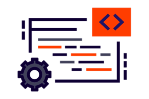

# Create videos or write about Liquibase
Liquibase works with many different databases and automation tools. We need your expertise to produce content about them! 
Whether you enjoy blogging, writing an article on Medium or want to promote your YouTube channel, sharing your knowledge makes an impact on our community.

## Explore Topics

Choose based on your experience! If you don’t have one in mind already, below are some suggestions to help kick-start your writing or video.

## Tutorials

{ align="left" width="72" }
Getting started with Liquibase [example](https://medium.com/podiihq/getting-started-with-liquibase-8965897092aa)

Share your step-by-step guide on how you use Liquibase (Include your specific database/integration) [example](https://reflectoring.io/database-migration-spring-boot-liquibase/){ .md-button }

## Tips & Tricks

{ align="left" width="72" }
Share your favorite Liquibase tips & tricks [examples](https://www.liquibase.org/category/tips-tricks)

Liquibase best practices [example](https://www.liquibase.org/get-started/best-practices)

## Use Cases

{ align="left" width="72" }
Share how you or your organization are using Liquibase. [example](https://www.liquibase.com/blog/database-change-automation-journey)

## Have your own idea?

Draft & submit your content idea to our docs Github repo!

[Docs GitHub Repo](https://github.com/Datical/liquibase-docs/issues/new){ .md-button }
