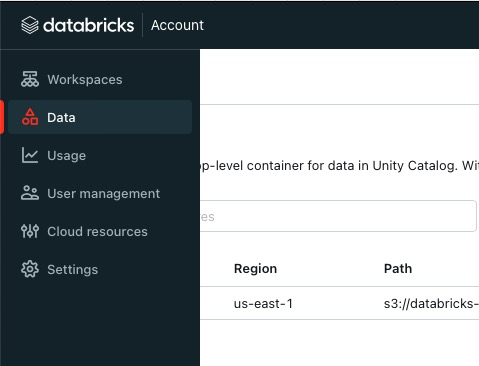
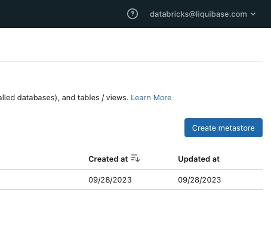
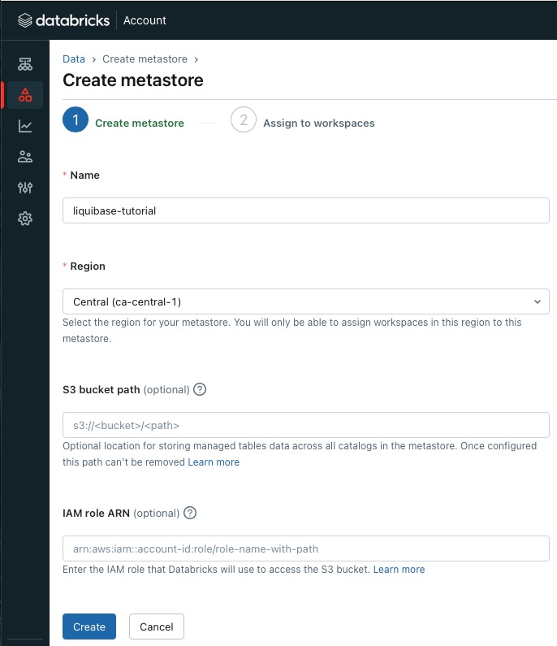
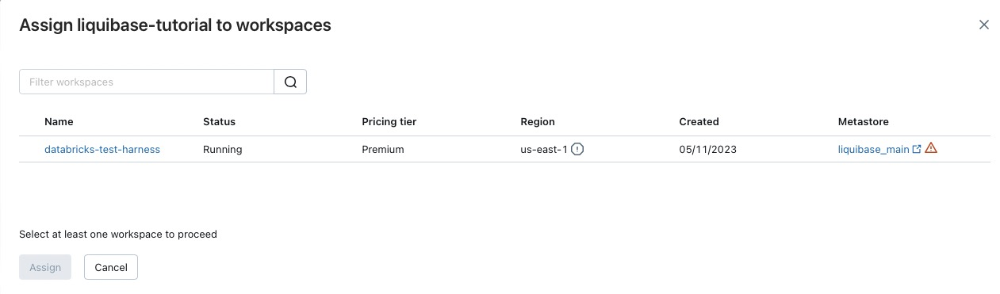

# Using Liquibase with Databricks Data Lakehouses

<!-- <small>Verified on: February 28, 2024</small> -->

A data lakehouse is a new, open data management architecture that combines the flexibility, cost-efficiency, and scale of data lakes with the data management and ACID transactions of data warehouses, enabling business intelligence (BI) and machine learning (ML) on all data.

The lakehouse architecture and [Databricks SQL](https://docs.databricks.com/en/sql/index.html) bring cloud data warehousing capabilities to your data lakes. Using familiar data structures, relations, and management tools, you can model a highly-performant, cost-effective data warehouse that runs directly on your data lake.

For more information on Databricks, see the [Databricks](https://www.databricks.com) website.

## Prerequisites

--8<-- "database-tutorial-prerequisites.md"

### Setup Databricks

1. If you don't already have a Databricks account, click the [Try Databricks](https://www.databricks.com) button to sign up. 

1. Login to Databricks and select Data from the left side navigation

    

1. If you don't already have a top level metastore, create one to hold your catalogs, schemas (also called databases), and tables/views.

    1. Click the Create Metastore button on the top right of the screen
    
        
    
    1. Enter your metastore Name and select a Region for your datastore.

        
    
    1. Create a Workspace and assign it to the Metastore.
    
        

1. Navigate to your Workspaces tab and click the Open Workspace button in the upper right of the page.

    

1. Click the SQL Editor option in the left navigation, enter your SQL to create your database (also called a schema), and click the Run button

    `CREATE DATABASE IF NOT EXISTS main.liquibase_tutorial_db;`

    

1. Your database is configured and ready to use.


## Install drivers

### All users

To use Databricks with Liquibase, you need to install two additional JAR file.

1. Download the jar files
    * Download the [Databricks JDBC driver](https://www.databricks.com/spark/jdbc-drivers-download) (`DatabricksJDBC42-<version>.zip`) from driver download site and unzip the folder to locate the `DatabricksJDBC42.jar` file.
    * Download the [Liquibase Databricks extension](https://github.com/liquibase/liquibase-databricks) (`liquibase-databricks-<version>.jar`) from the GitHub Assets listed at the end of the release.

1. [Place your JAR file(s)](https://docs.liquibase.com/workflows/liquibase-community/adding-and-updating-liquibase-drivers.html) in the `<liquibase_install_dir>/lib` directory.
    * `DatabricksJDBC42.jar`
    * `liquibase-databricks-<version>.jar`
      
    !!! Note
        If you are running your project on MacOS or Linux, you might need to run the following command in your terminal 
        (you can add it to your bash profile as well) to allow the dependencies to work properly:
        
        `export JAVA_OPTS=--add-opens=java.base/java.nio=ALL-UNNAMED`

### Maven users (additional step)

If you use Maven, note that this database does not provide its driver JAR on a public Maven repository, so you must install a local copy and [add it as a dependency](https://docs.liquibase.com/tools-integrations/maven/using-liquibase-and-maven-pom-file.html) to your `pom.xml` file.

```
<dependency>
    <groupId>com.databricks</groupId>
    <artifactId>databricks-jdbc</artifactId>
    <version>[2.6.36,)</version>
</dependency>
<dependency>
    <groupId>org.liquibase.ext</groupId>
    <artifactId>liquibase-databricks</artifactId>
    <version>[1.1.3,)</version>
</dependency>
```

### Verify installation

Run the following command to confirm you have successfully installed everything:

`liquibase --version`

Review the libaries listing output for the two newly installed jar files: (`DatabricksJDBC42-<version>.zip` and `liquibase-databricks-<version>.jar`).


## Database connection

### Configure connection

1.  Specify the database JDBC URL in the [`liquibase.properties`](https://docs.liquibase.com/concepts/connections/creating-config-properties.html) file (defaults file), along with other properties you want to set a default value for. Liquibase does not parse the URL.

    ```
    liquibase.command.url: jdbc:databricks://<your_workspace_host_name>:443/default;transportMode=http;ssl=1;httpPath=/sql/1.0/warehouses/<your_warehouse_id>;AuthMech=3;ConnCatalog=main;ConnSchema=<your_connection_database/schema>;
    ```
    
    !!! Note
        Additional information on specifying the Databricks JDBC connection can be found in the [Databricks JDBC Driver](https://docs.databricks.com/en/integrations/jdbc/index.html) documentation.

1. Specify your username and password in the [`liquibase.properties`](https://docs.liquibase.com/concepts/connections/creating-config-properties.html) file (defaults file)

    1. The username, in our case is just “token” for the user or Service Principal you want to manage Liquibase.

    ```
    # Enter the username for your Target database.
    liquibase.command.username: token
    ```
    
    1. This is the user or Service Principal token we want to use to authenticate. This is usually passed in dynamically using frameworks like GitActions + Secrets.
    
    ```    
    # Enter the password for your Target database.
    liquibase.command.password: <your_token_here>
    ```


### Test connection

--8<-- "database-tutorial-relational-test-connection-example.md"

## Related links

* [Database Change Management on Lakehouse with Databricks SQL and Liquibase](https://medium.com/dbsql-sme-engineering/database-change-management-on-lakehouse-with-databricks-sql-and-liquibase-c3c238781616)
* [Advanced Schema Management on Databricks with Liquibase](https://medium.com/dbsql-sme-engineering/advanced-schema-management-on-databricks-with-liquibase-1900e9f7b9c0)