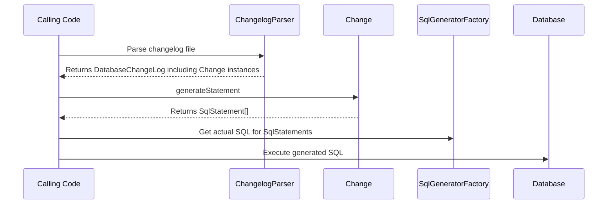

# Creating new Change Types

## Overview

`liquibase.change.Change` implementations define what logic can be called from `changeSet` blocks in your changelog files. 
Think of them as higher-level functions that shield users from needing to know the details of what it takes to perform a change.  

Liquibase ships with a large number of standard changes such as:

- createTable
- addColumn
- dropView
- introduceLookupTable
- etc.

but extensions can provide **_any_** functionality desired.  

Each Change generates a series of SqlStatements from the given input arguments. 

!!! tip

    `Change` instances define what "change functions" are available to the end user and the arguments they take. 
    They should only deal with database-agnostic `SqlStatement` and not directly interact with the database.     

    See [the SqlGenerator guide](../add-a-sql-generator/index.md) for more information on SqlStatements and SqlGenerators.

## Change Selection

Each `Change` has a "name", and the ChangeLogParser selects the correct implementation by matching the name in the changelog file with the names defined by Change implementations.

To determine which `Change` to use, Liquibase will find all the implementations that use the given name and choose the one with the highest [priority](../../extension-references/priority.md).
This allows extensions to either define a new Change OR override an existing Change with a given name.

## Prerequisites

Implementing support for additional databases requires an understanding of Java. You will be creating classes, overriding methods, and working with inheritance hierarchies.

## Project Setup

If you have not already created a repository to hold your code, see [Your First Extension](../../your-first-extension.md) in the Getting Started guide.

## Next Steps

When you are ready to create your new `Change`, head to the [Create a Change](create.md) page.