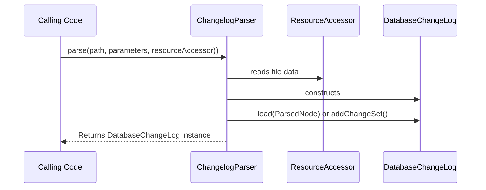

# New Changelog Formats

## Overview

`liquibase.parser.ChangeLogParser` implementations allow you to read database changelog files written in different formats.  

Liquibase ships with XML, YAML, JSON, and SQL parsers, but there is nothing special about those formats in the Liquibase internals.

Examples of custom parsers include:

- A parser for a custom Liquibase DSL
- A parser to read database changes stored in a 3rd party system

The job of the parser is to read an input stream and create a [liquibase.changelog.DatabaseChangeLog](https://javadocs.liquibase.com/liquibase-core/liquibase/changelog/DatabaseChangeLog.html){:target="_blank"} out of it.

If your changelog format is a different way of formatting the same structure used in xml/yaml/json changelogs, you can create a `liquibase.parser.core.ParsedNode` intermediate format and pass it to DatabaseChangeLog's `load()` method.
If your changelog format is more custom, you can call the various `add` methods on DatabaseChangeLog to configure it based on the contents of your file before returning it.

## Change Selection

Each `ChangeLogParser` has a method to has a `supports()` method which determines if it can parse the given file. 

To determine which supported `ChangeLogParser` to use, Liquibase will find all the implementations that use the given name and choose the one with the highest [priority](../../extension-references/priority.md).
This allows extensions to either define a new format OR override an existing parser.

## Prerequisites

Implementing support for additional databases requires an understanding of Java. You will be creating classes, overriding methods, and working with inheritance hierarchies.

## Project Setup

If you have not already created a repository to hold your code, see [Your First Extension](../../your-first-extension.md) in the Getting Started guide.

## Next Steps

When you are ready to create your new `Change`, head to the [Create a Changelog Parser](create.md) page.