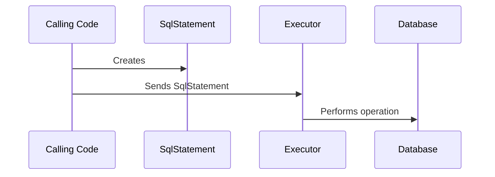

# Additional "RunWith" Options

## Background

In order to run statements against your target database, Liquibase creates [liquibase.statement.SqlStatement](https://javadocs.liquibase.com/liquibase-core/liquibase/statement/SqlStatement.html){:target="_blank"}
objects describing the operation to perform. 

These could be more descriptive requests, like [liquibase.statement.core.CreateTableStatement](https://javadocs.liquibase.com/liquibase-core/liquibase/statement/core/CreateTableStatement.html){:target="_blank"} 
or one that simply specifies exactly what should be run like [liquibase.statement.core.RawSqlStatement](https://javadocs.liquibase.com/liquibase-core/liquibase/statement/core/RawSqlStatement.html){:target="_blank"}.

However, the SqlStatement only describes the operation to perform -- it is up to the [liquibase.executor.Executor](https://javadocs.liquibase.com/liquibase-core/liquibase/executor/Executor.html){:target="_blank"}
to know how to run that statement against the database.

The default `Executor` is [liquibase.executor.jvm.JdbcExecutor](https://javadocs.liquibase.com/liquibase-core/liquibase/executor/jvm/JdbcExecutor.html){:target="_blank"} 
which converts the `SqlStatements` to SQL and sends them to the database through the JDBC driver.

However, extensions can plug in any other database interactions needed. For example, you could send the desired SQL through an external CLI instead. 

## Executor Selection

Each `Executor` has a "name", and the calling code always sends each `SqlStatement` to a particular executor name. By default, the executor name used is `jdbc`, but that can be overridden with the `runWith` attribute on `changeSet`.

To determine which `Executor` to use, Liquibase will find all the implementations that use the given name and choose the one with the highest [priority](../../extension-references/priority.md).
This allows extensions to either define a new name OR override an existing Executor with a given name.

## Prerequisites

Implementing support for additional databases requires an understanding of Java. You will be creating classes, overriding methods, and working with inheritance hierarchies.

## Project Setup

If you have not already created a repository to hold your code, see [Your First Extension](../../your-first-extension.md) in the Getting Started guide.

## Next Steps

When you are ready to create your new `Executor`, head to the [Create an Executor](create.md) page.