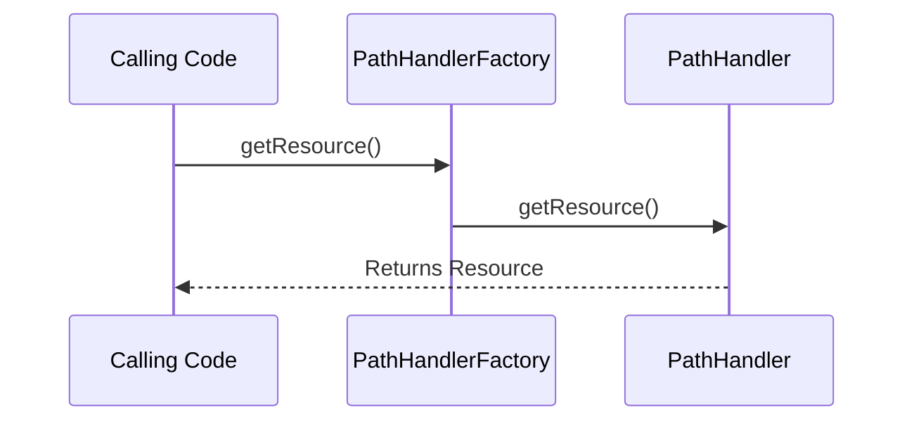

# Creating New PathHandlers

## Overview

`liquibase.resource.PathHandler` implementations allow Liquibase to read files from different physical locations. 

They differ from [ResourceAccessors](../add-a-resource-accessor/index.md) in that `ResourceAccesors` are used for looking up file references within changelogs, 
whereas `PathHandlers` are used to look up files referenced outside changelogs. 

!!! note

    `PathHandler` implementations can construct ResourceAccessors. This allows new the file lookup logic provided by custom PathHandlers to be used
    in the `liquibase.searchPath` setting.  

Liquibase ships with [liquibase.resource.DirectoryPathHandler](https://javadocs.liquibase.com/liquibase-core/liquibase/resource/DirectoryPathHandler.html){:target="_blank"}
which looks up paths without a protocol as a relative or absolute file paths. Any custom PathHandlers should generally recognize paths they handle through an expected URL-like protocol, such as `ftp://example.com/my/file.sql`. 

## PathHandler Selection

Each `PathHandler` defines a `getPriority(path)` method which returns the [priority](../../extension-references/priority.md) for handling that particular path.
`PathHandlerFactory` will use the `PathHandler` that returns the highest priority value.
This allows extensions to either define a new way to look up files OR override existing logic.

## Prerequisites

Implementing support for additional databases requires an understanding of Java. You will be creating classes, overriding methods, and working with inheritance hierarchies.

## Project Setup

If you have not already created a repository to hold your code, see [Your First Extension](../../your-first-extension.md) in the Getting Started guide.

## Next Steps

When you are ready to create your new `PathHandler`, head to the [PathHandler](create.md) page.