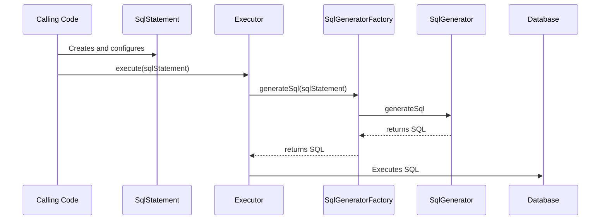

# Creating New SQL Generators

## Overview

`liquibase.statement.SqlStatement` implementations define specific operations that can be run against a database, such as 
`liquibase.statement.core.CreateTableStatement` or `liquibase.statement.core.DropColumnStatement`. 
However, they only define the **_what_**, not the **_how_**. 

It is the job of the `liquibase.sqlgenerator.SqlGenerator` implementations to know how to actually apply those operations to a given database.

For more information on creating new change types, see the [change types guide](../add-a-change-type/index.md).

!!! tip

    The default SqlGenerators for a given SqlStatement are named by replacing "Statement" from the class name with "Generator".
    For example, CreateTableStatement -> CreateTableGenerator.

    For SqlGenerators that handle specific environments, append a description of what makes it different to the end.
    For example, CreateTableStatement -> CreateTableGeneratorOracle

!!! tip

    If you are looking to define a new operation, create a new `SqlStatement` class and then the `SqlGenerator` for it.

!!! example

    When parsing a changelog file, Liquibase creates a `CreateTableChange` object with the table name and column definitions specified in the changelog file.
    When the Change is "executed", it will first create a `CreateTableStatement` object containing the same information and pass that to the `Executor`. 
    Liquibase will then go through all the available `SqlGenerators` that say they support `CreateTableStatement` for the given database and use the one with the
    highest priority to come up with the actual SQL to run in order to create the table.

## SqlGenerator Selection

Each `SqlGenerator` has a `supports()` method which the `SqlGeneratorFactory` uses to determine which implementations can apply the SqlStatement to the given database.

Of all the supported `SqlGenerator` implementations, Liquibase will use the one with the highest [priority](../../extension-references/priority.md).
This allows extensions to either define a default logic for a SqlStatement OR override other SqlGenerators with a better implementation.

## Prerequisites

Implementing support for additional databases requires an understanding of Java. You will be creating classes, overriding methods, and working with inheritance hierarchies.

## Project Setup

If you have not already created a repository to hold your code, see [Your First Extension](../../your-first-extension.md) in the Getting Started guide.

## Next Steps

When you are ready to create your new `SqlGenerator`, head to the [Create a SqlGenerator](create.md) page.