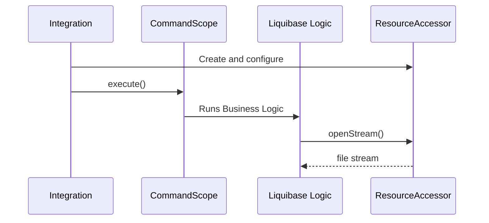

# Configure File Access

## Overview

There are two styles of file access that Liquibase supports: 

- File references **_within_** changelog files which must **_remain constant across environments_** are handled by the ["ResourceAccessor"](#resourceaccessor) (also known as the "Search Path")
- File references **_outside_** changelog files which use **_environment-specific_** paths are handled by the ["PathHandler"](#pathhandler)

The reason changelog files are handled differently is that the changelog file must be used unchanged across different environments and run through various integrations.

## Search Path

The [ResourceAccessor API](../../code/api/resource-resourceaccessor.md) provides the abstraction around how changelog-related files are looked up and read 
which allows the file references encoded into changelog files to be usable across a wide range of environments without changes.

The final, overall ResourceAccessor is exposed to end users as the "Search Path"

Each integration needs to configure the `ResourceAccessor` and set it in the `liquibase.Scope`




### SearchPathResourceAccessor

While the overall ResourceAccessor can be created in whatever way works best, you should generally create an instance of
[SearchPathResourceAccessor](https://javadocs.liquibase.com/liquibase-core/liquibase/resource/SearchPathResourceAccessor.html){:target="_blank"}
passing along their specified search path and any other ResourceAccessors that should be searched as well.

This provides consistent behavior compared to other integrations.  

### CompositeResourceAccessor

If your integration can't use SearchPathResourceAccessor, use [CompositeResourceAccessor](https://javadocs.liquibase.com/liquibase-core/liquibase/resource/CompositeResourceAccessor.html){:target="_blank"}
to combine multiple ResourceAccessors into an overall "search path" ResourceAccessor.

Liquibase ships with some standard/common ResourceAccessor implementations including:

- `liquibase.resource.DirectoryResourceAccessor` for reading files from the filesystem
- `liquibase.resource.ClassLoaderResourceAccessor` for reading files from the Java classpath
- `liquibase.resource.ZipResourceAccessor` for reading files from a zip or jar file

## Custom ResourceAccessors and PathHandlers

If your integration needs to define its own providers, see [Add a ResourceAccessor](../extension-guides/add-a-resource-accessor.md) or
[Add a PathHandler](../extension-guides/add-a-path-handler.md)

## API Documentation

The following pages give a complete description of the APIs, including what methods must be implemented:

- [liquibase.resource.ResourceAccessor](../../code/api/resource-resourceaccessor.md)
- [liquibase.resource.PathHandler](../../code/api/resource-pathhandler.md)
- [liquibase.resource.Resource](../../code/api/resource-resource.md)

## Example Code

### SearchPathResourceAccessor 

```java
//set up ConfigurationValueProviders 

Scope.child(Scope.Attr.resourceAccessor, new SearchPathResourceAccessor(), () -> {
    //Code in this lambda will use the new ResourceAccessor
});
```

The above code will automatically create ResourceAccessors for each element in the `liquibase.searchPath` configuration setting at the point the `new SearchPathResourceAccessor()` constructor was called.
For information on how to set up ConfigurationValueProviders, see [configure configuration system](configure-configuration.md).

If there are additional ResourceAccessors you would like included regardless of the configured `liquibase.searchPath`, you can pass them along in the constructor like this:

```java
ResourceAccessor resourceAccessor = new SearchPathResourceAccessor(
        new DirectoryResourceAccessor(projectHome),
        new ZipResourceAccessor(Paths.get("/tmp/optional.zip"))
);

Scope.child(Scope.Attr.resourceAccessor, resourceAccessor, () -> {
    //Code in this lambda will use the new ResourceAccessor
});
```

### CompositeResourceAccessor

If you need complete control over the search path and do not want to expose the `liquibase.searchPath` setting to end users, you can create a `CompositeResourceAccessor` directly:

```java
ResourceAccessor resourceAccessor = new CompositeResourceAccessor(
        new DirectoryResourceAccessor(projectHome),
        new ZipResourceAccessor(Paths.get("/tmp/optional.zip"))
);

Scope.child(Scope.Attr.resourceAccessor, resourceAccessor, () -> {
    //Code in this lambda will use the new ResourceAccessor
});
``` 