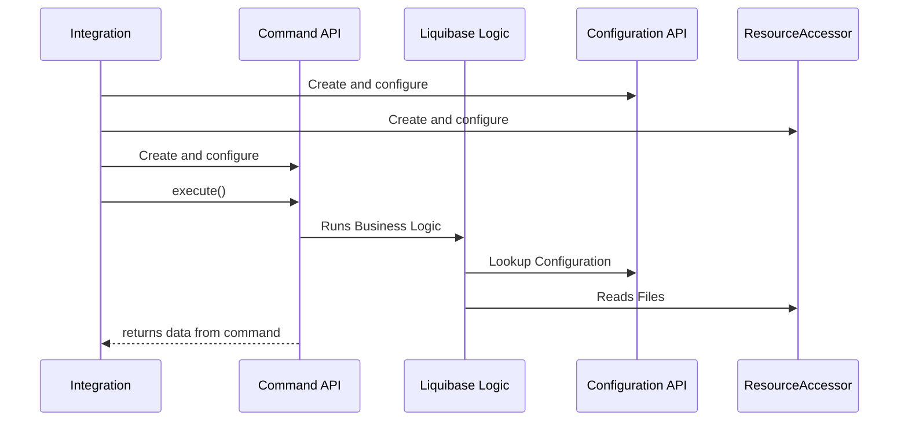

# Integrations Overview

Liquibase's logic is built with no expectation on **_how_** it is run. The same logic can be called from a CLI, from Maven, embedded in a 3rd party application, or from anywhere else.

Because Liquibase is written in Java, any application running on the JVM can easily integrate with it. 

## What Can Integrations Do?

Integrations can be either a lightweight wrapper adapting all the Liquibase commands to a new way of running, or a custom application picking and choosing what parts of Liquibase to call.

### Liquibase On Demand

One category of integrations build Liquibase into a tool that exposes all the available Liquibase commands for users to run on demand.
Examples of this type of integration include the Liquibase CLI, Maven plugin, Gradle plugin, Ant plugin, and the NPM plugin. 

These integrations act as a thin wrapper adapting the available Liquibase commands to a way of calling them. 
        
### Liquibase Embedded

Another category of integrations build specific Liquibase operations into flows within an application framework
Examples of this type of integration include Spring, Spring Boot, Quarkus, Micronaut and Servlet Listener support. 

These integrations will run `update` automatically against the application's database on startup. 
Because they are automatically running Liquibase, they do not allow arbitrary commands to be run like the "On Demand" integrations.   

### Custom Integrations

If you have complex "on demand" use cases or the frameworks you use don't support the commands you need to execute, you can write whatever logic you want around calls to Liquibase.

Examples of this include building Liquibase into your automated test setup, running Liquibase multi-threaded across all your database shards, or a single CLI to your users that combine Liquibase with other tools.

!!! note

    If you are looking to build new functionality **_onto_** Liquibase rather building Liquibase **_into_** something else, see [the extensions documentation](../index.md) 

## Primary Integration Points

### Command API

The primary facade for calling Liquibase is through the `liquibase.command` package. The commands provide the pluggable, complete operations that can be performed.

For more information, see [the Command API documentation](../../code/api/command-commandscope.md)

### Configuration API

Liquibase has an extendable and cascading configuration system. 

Each integration can configure the various places configuration values can be pulled from (arguments, environment variables, configuration files, etc.) and the priority of each
before running the commands that will look up configuration values.

For more information, see [the Configure Configuration Guide](../integration-guides/configure-configuration.md)

### ResourceAccessor API

Liquibase allows each integration to control how files are found via the ResourceAccessor API. 
This is what is exposed to users as the [search path](https://docs.liquibase.com/concepts/changelogs/how-liquibase-finds-files.html){:target="_blank"}

Each integration can configure where and how to look up files before running the commands that will read them.

For more information, see [the Configure File Access Guide](../integration-guides/configure-file-access.md)

## Lower Level Integration Points

If the "command" level facade is too high-level for your needs, you can always drop down to use the lower-level objects instead.

The complete API can be found in the ["Code API" section](../../code/api/index.md).

