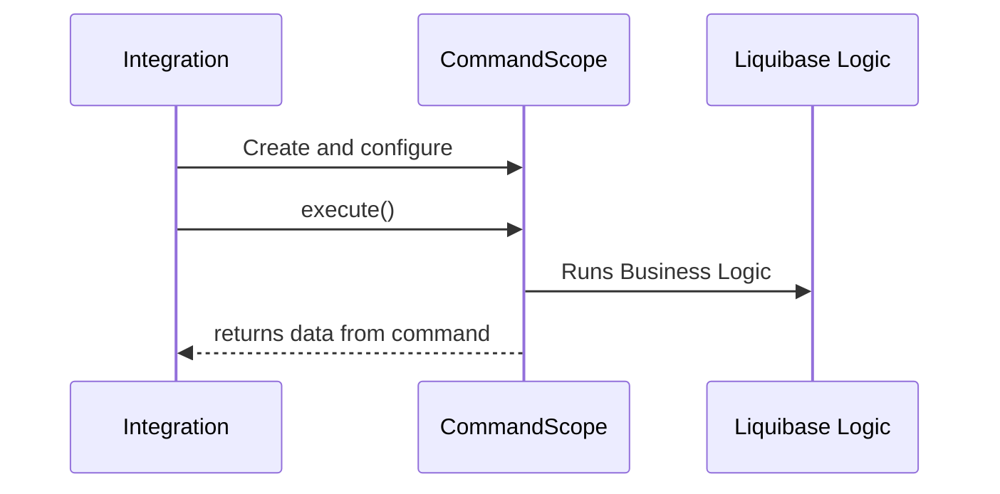

# Command API

The command API in the `liquibase.command` package is the primary high-level facade for running Liquibase operations. 
The API provides both a way to call individual commands and metadata about each command including human-readable descriptions and argument information. 

The operations available through the command API are end-user facing, complete calls such as "update", "rollback", or "generateChangelog".

The available commands are a pluggable extension point, and the command API provides a consistent and stable way to work with the commands regardless of what extensions are installed.

## Executing Commands

Commands are executed through the [liquibase.command.CommandScope](https://javadocs.liquibase.com/liquibase-core/liquibase/command/CommandScope.html){:target="_blank"} class.

The `CommandScope` object defines a self-contained call to a specific command, where any configuration applied to it applies only to that command call. 
Each call to a command will require a separate `CommandScope` instance.

### Creating the Command

When constructing the `CommandScope` object, the name of the command is passed in. For example, `new CommandScope("update");` 

If the command has a "nested" name, include the entire command "path" such as `new CommandScope("init", "project")`.  

### Setting Arguments

Arguments are added via the `addArgumentValue(...)` methods. 

The basic version uses a string argument name, such as `commandScope.addArgumentValue("url", "jdbc:my://database")`. 
This allows you to easily set any arbitrary argument, but you do have to be careful about spelling as there is no type safety.  

Alternatively, you can use the version that takes a `CommandArgumentDefinition` you reference from the code that defines the command itself. 
For example, `commandScope.addArgumentValue(UpdateCommandStep.URL, "jdbc:my://database")`.
This ensures your argument name exists and provides compile-time type safety on the value passed, but requires you to find the CommandDefinition field to use.

### Configuring Output

By default, any command output will go to `System.out`. 
The "command output" is reserved for the command's actual output and is separate from the errors, logged messages, and status updates which are handled via the `liquibase.logging.Logger` and `liquibase.ui.UIService`.

If you would like the command output to go to a different stream, call `commandScope.setOutput(altStream)`

### Executing

After setting the command arguments, you can execute the command with `CommandResults result = commandScope.execute()`. 
This will run the command's logic and return a `CommandResults` object which can contain objects created during the command execution.

### Command Results

Commands are able to attach any objects they would like to the response, which can be accessed via the `result.getResult(...)` methods. 
For example, the `snapshot` command may attach the `liquibase.snapshot.DatabaseSnapshot` object it built up as a result. 

Like the argument settings, results can be accessed either by the string name of the result like `result.getResult("snapshot")` 
or by a pre-defined `CommandResultDefinition` object like `result.getResult(SnapshotCommandStep.SNAPSHOT_RESULT)` to provide type safety.  

## Reading Command Metadata

The command metadata is available through the [liquibase.command.CommandFactory](https://javadocs.liquibase.com/liquibase-core/liquibase/command/CommandFactory.html){:target="_blank"} singleton.
Like all singletons, you access the instance via `Scope.getSingleton(CommandFactory.class)`.

For integrations that are looking to expose all Liquibase functionality to end users, such as the CLI or Maven integrations, the `CommandFactory` allows you to programmatically and dynamically
expose everything Liquibase (including installed extensions) supports to your users.    

From the `CommandFactory`, you can call `getCommands()` to list all the available commands. For each command, it returns the [liquibase.command.CommandDefinition](https://javadocs.liquibase.com/liquibase-core/liquibase/command/CommandDefinition.html){:target="_blank"} for it.

The `CommandDefinition`s include:
- Name
- ShortDescription
- LongDescription
- Argument information such as name, aliases, description, and default value

Both commands and arguments can be listed as "hidden" which are commands or arguments that can be used but are **_usually_** not user-facing.

If you know the specific command you want the `CommandDefinition` for, you can look it up directly via `commandFactory.getCommand(String)`.

