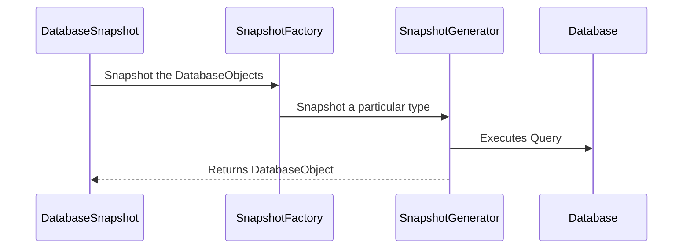

## Defining a New liquibase.snapshot.SnapshotGenerator Implementation

### Overview

Liquibase defines a database-independent metadata model in [liquibase.snapshot.DatabaseSnapshot](https://javadocs.liquibase.com/liquibase-core/liquibase/snapshot/DatabaseSnapshot.html)
That model contains standardized [liquibase.structure.DatabaseObject](https://javadocs.liquibase.com/liquibase-core/liquibase/structure/DatabaseObject.html) objects such as
[liquibase.structure.core.Table](https://javadocs.liquibase.com/liquibase-core/liquibase/structure/core/Table.html).

The snapshot logic used in not just `liquibase snapshot` but also `liquibase diff` and `liquibase diff-changelog` relies on [liquibase.snapshot.SnapshotGenerator](https://javadocs.liquibase.com/liquibase-core/liquibase/snapshot/SnapshotGenerator.html)
implementations to read the database's metadata and create the corresponding `DatabaseObject` objects



For example, to snapshot a Column SnapshotFactory will go through all the available `SnapshotGenerators` that say they support `Column` for the given database and use the one with the
highest priority.

Defining database-specific functionality tends to be writing `if (database instanceof ExampleDatabase)` blocks
around the non-standard calls. Using "instanceof" means the block will apply to any subclasses of the given database.
For example, if your database is PostgreSQL compatible and therefore your Database class extensions `PostgresDatabase` then all the
`if (database instanceof PostgresDatabase)` checks will be used for your database as well.

### Implementing

When adding support for a new Database, there will be existing `SnapshotGenerator` implementations for all `DatabaseObject` types.
It is usually easiest to subclass the existing SnapshotGenerator to leverage the standard logic, but it's not necessary.

The naming pattern tends to be "ObjectType" + "SnapshotGenerator". For example, Column -> ColumnSnapshotGenerator.
Database-specific classes append the database name to the end, like `ColumnSnapshotGeneratorOracle`.

#### Empty Constructor

Like all Liquibase extensions, your SnapshotGenerator must have an empty constructor.

#### getPriority(DatabaseType, Database) and replaces(Class)

The `getPriority` works a bit different than other extensions in that it's not used to choose the single "best" implementation to use, but rather to choose the order to run SnapshotGenerators in. 

Like other getPriority methods, if your implementation does not apply for the given type/database combination, return `liquibase.snapshot.PRIORITY_NONE`.

However, Liquibase will use ALL instances that return a priority > 0 to snapshot an object. 
Therefore, if your extension is replacing a base SnapshotGenerator you override the `replaces()` function rather than returning a higher value from `getPriority()`.
The `replaces()` function lets you say "use this class in the snapshot logic instead of another one".

A good example implementation for a class that replaces the default ColumnSnapshotGenerator is:

```java
    @Override
    public int getPriority(Class<? extends DatabaseObject> objectType, Database database) {
        if (database instanceof ExampleDatabase) {
            return super.getPriority(objectType, database);
        } else {
            return PRIORITY_NONE;
        }
    }

    @Override
    public Class<? extends SnapshotGenerator>[] replaces() {
        return new Class[] {
                ColumnSnapshotGenerator.class
        };
    }
```

which relies on the superclass's "should I be part of the snapshot process for the given type" logic but only for ExampleDatabase while also taking the place of ColumnSnapshotGenerator when it's used.

### snapshot(DatabaseObject example, DatabaseSnapshot snapshot, SnapshotGeneratorChain chain)

This is the function which is called by the snapshot system to either lookup the information about the given `example` object, OR add additional information to it.
Multiple SnapshotGenerator instances will work together to build up the final snapshot of the object.

The overall flow is:
1. The calling code defines the "example" object it wants. 

For example, if they want to snapshot a Table with the name "address" they construct a `liquibase.structure.core.Table` object and set the name to be "address". 
To look up the table in a different schema, they set the schema attribute on Table to the desired schema.
The "example" object will contain the fields set that should be used to identify the actual object to snapshot. 

2. The snapshot system will collect up all the SnapshotGenerators that say they should participate in the snapshot and call the `snapshot` method in `getPriority()` order.

For example, when snapshotting an example Table, the `TableSnapshotGenerator.snapshot()` call will run first which captures the table name, schema, etc.  
Then the ColumnSnapshotGenerator.snapshot() will run which snapshots all the columns associated with the table and adds those columns to the Table object.

3. After all the SnapshotGenerators have added their information to the Table object, it's returned to the calling code.

There is a [liquibase.snapshot.jvm.JdbcSnapshotGenerator](https://javadocs.liquibase.com/liquibase-core/liquibase/snapshot/jvm/JdbcSnapshotGenerator.html) convenience base class that is used for all the standard `DatabaseObject` SnapshotGenerators which
separates the "create the base object" logic from the "add to an object" logic plus has caching built into it. 

The standard SnapshotGenerators tend to have overridable functions for commonly variable portions of the snapshot logic, so you generally shouldn't override
snapshot itself but more targeted methods instead.

#### Register your Class

Like all extensions, your SnapshotGenerator must be registered by adding your class name to `META-INF/services/liquibase.snapshot.SnapshotGenerator`

### Example Code

```java
package com.example.snapshot;

import com.example.database.ExampleDatabase;
import liquibase.database.Database;
import liquibase.snapshot.CachedRow;
import liquibase.snapshot.SnapshotGenerator;
import liquibase.snapshot.jvm.ColumnSnapshotGenerator;
import liquibase.structure.DatabaseObject;
import liquibase.structure.core.Column;

public class SnapshotColumnGeneratorExample extends ColumnSnapshotGenerator {

    @Override
    public int getPriority(Class<? extends DatabaseObject> objectType, Database database) {
        if (database instanceof ExampleDatabase) {
            return super.getPriority(objectType, database);
        } else {
            return PRIORITY_NONE;
        }
    }

    @Override
    public Class<? extends SnapshotGenerator>[] replaces() {
        return new Class[] {
                ColumnSnapshotGenerator.class
        };
    }

    @Override
    protected Object readDefaultValue(CachedRow columnMetadataResultSet, Column columnInfo, Database database) {
        if (columnInfo.getType().getTypeName().equalsIgnoreCase("json")) {
            return columnMetadataResultSet.get("default_value_json");
        } else {
            return super.readDefaultValue(columnMetadataResultSet, columnInfo, database);
        }
    }
}
```