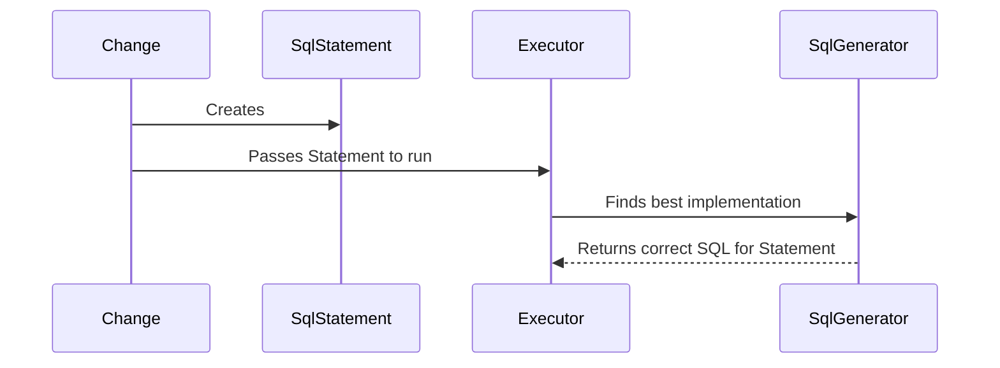

## New SqlGenerator Implementations

### Overview

When working through [milestone 2](milestone2-step2.md), you will often need to create new [liquibase.sqlgenerator.SqlGenerator](https://javadocs.liquibase.com/liquibase-core/liquibase/sqlgenerator/SqlGenerator.html){:target="_blank"} implementations.

These are what convert the "describe what you want, not how to do it" Change and SqlStatement objects in to the SQL that your database understands.

## Flow

Liquibase defines database-independent requests for an action in [liquibase.change.Change](https://javadocs.liquibase.com/liquibase-core/liquibase/change/Change.html){:target="_blank"}
and [liquibase.statement.SqlStatement](https://javadocs.liquibase.com/liquibase-core/liquibase/statement/SqlStatement.html){:target="_blank"}
classes. Change classes are what can be called from changelog files, and SqlStatement classes describe the lower-level calls that translate more directly to SQL statement.

Both `Change` and `SqlStatement` simply _**describe**_ what wants to be done without specifying **_how_** to carry that out.
It is the job of the `SqlGenerator` to create the correct SQL for a given `Statement` definition.



!!! example

    When parsing a changelog file, Liquibase creates a `CreateTableChange` object with the table name and column definitions specified in the changelog file.
    When the Change is "executed", it will first create a `CreateTableStatement` object containing the same information and pass that to the `Executor`. 
    Liquibase will then go through all the available `SqlGenerators` that say they support `CreateTableStatement` for the given database and use the one with the
    highest priority to come up with the actual SQL to run in order to create the table.

## Implementation Overview

When adding support for a new Database, there will be existing `SqlGenerator` classes for all `SqlStatement` objects. 
They will try to be database-generic, but sometimes the SQL is not valid for your database. 
It is usually easiest to subclass the existing SqlGenerator to leverage the standard logic, but it's not necessary.

The naming pattern tends to be "SqlStatementType" + "Generator". For example, AddColumnStatement -> AddColumnGenerator.
Database-specific classes append the database name to the end, like `AddColumnStatementOracle`.

Defining database-specific functionality tends to be writing `if (database instanceof ExampleDatabase)` blocks
around the non-standard calls. Using "instanceof" means the block will apply to any subclasses of the given database. 

!!! example

    The default `AddColumnGenerator` may return `"alter table "+dialect.quoteName(tableName) + " add column ..."`
    but `AddColumnGeneratorMysql` will override it to be `"alter table "+dialect.quoteName(tableName) + " modify column ..."`.

When adding support for a new Database, there will be existing `SqlGenerator` implementations for all `SqlStatement` types. 
It is usually easiest to subclass the existing SqlGenerator to leverage the standard logic, but it's not necessary. 

The naming pattern tends to be "StatementName" + "Generator". For example, AddColumnStatement -> AddColumnGenerator.
Database-specific classes append the database name to the end, like `AddColumnGeneratorOracle` 

## Implementation Details

### Empty Constructor

Like all Liquibase extensions, your SqlGenerator must have an empty constructor.

### supports(SqlStatement, Database)

The supports function returns whether this SqlGenerator should be used for the given SqlStatement and Database combination.

If you define your SqlGenerator class using generics, Liquibase will know the SqlStatement type you can support and not bother calling `supports()`
unless the SqlStatement class is correct. Therefore, you only have to check that the Database object is correct. 

You can normally check this with `instanceof`, but you can call methods on the Database object to check versions or whatever else is needed to determine if this class needs to generate custom SQL or not. 

### getPriority()

You **_must_** override getPriority() so it will be picked over the base implementation you are extending. If you do not override this function they will both 
return the same priority and which is chosen is random.

To ensure a higher value is returned, use something like `return super.getPriority() + 5`.

### validate(SqlStatement, Database, SqlGeneratorChange) and warn

The validate method is used to check that the configuration of the SqlStatement is correct. It's the job of this function to ensure any required settings are set and
any invalid settings are not used. 

When extending a base SqlGenerator, you can call `super.validate(statement, database, sqlGeneratorChain)` as a starting point, and then perform extra checks 
(or remove not-actually-invalid errors) before returning the [ValidationErrors](https://javadocs.liquibase.com/liquibase-core/liquibase/exception/ValidationErrors.html){:target="_blank"}.

This method is always called, and so you do not need to re-validate settings in other methods.

If you have no additional validation to perform vs. the base logic there is no need to override this method.

The `warn(SqlStatement, Database, SqlGeneratorChange)` is similar to `validate` but returns non-fatal warnings to the user. 

### generateSql(SqlStatement, Database, SqlGeneratorChain)

This is the method that generates the SQL for your particular database. It returns an array of [liquibase.sql.Sql](https://javadocs.liquibase.com/liquibase-core/liquibase/sql/Sql.html){:target="_blank"}
objects and so a single `SqlStatement` class can create multiple underlying SQL statements. For example, `AddPrimaryKeyGenerator` may return a SQL call to add the primary key and another to reorganize the table.

Depending on how different your SQL is from the base class, you can either call `super.generateSql()` and modify the objects in the array before returning it, or 
create a new `Sql[]` array from scratch. It tends to be best to modify the SQL generated by the parent class because that keeps you from having to duplicate all the
argument handling logic that already exists in the parent.

Also remember to always check your parent class's method signature for settings it defines. It may have methods like `nullComesBeforeType()` which it uses to determine
the final SQL and you simply have to override that method to return a different value.

[liquibase.sql.UnparsedSql](https://javadocs.liquibase.com/liquibase-core/liquibase/sql/UnparsedSql.html){:target="_blank"} is the implementation of `liquibase.sql.Sql` you will almost always want to use in your `Sql[]` array.

!!! warning

    When generating your SQL you should try as hard as possible to rely purely on the fields in the `SqlStatement` function to determine the SQL to generate.
    
    If you have to query the database for more information or check any other external information you must ensure `generateStatementsIsVolatile()` returns true.
    That lets Liquibase know that each run of the SqlStatement may generate different results and therefore can't be used in `update-sql` type operations.

## Example Code

```java
package com.example.sqlgenerator;

import liquibase.database.Database;
import liquibase.sql.Sql;
import liquibase.sql.UnparsedSql;
import liquibase.sqlgenerator.SqlGeneratorChain;
import liquibase.sqlgenerator.core.AddColumnGenerator;
import liquibase.statement.core.AddColumnStatement;

public class AddColumnGeneratorExample extends AddColumnGenerator {
    @Override
    public int getPriority() {
        return super.getPriority() + 5;
    }

    @Override
    public Sql[] generateSql(AddColumnStatement statement, Database database, SqlGeneratorChain sqlGeneratorChain) {
        Sql[] originalSql = super.generateSql(statement, database, sqlGeneratorChain);

        return new Sql[] {
                new UnparsedSql(originalSql[0].toSql().replace("ALTER COLUMN", "MODIFY COLUMN"))
        };
    }
}
```

## Register your Class

Like all extensions, your SqlGenerator must be registered by adding your class name to `META-INF/services/liquibase.sqlgenerator.SqlGenerator`

