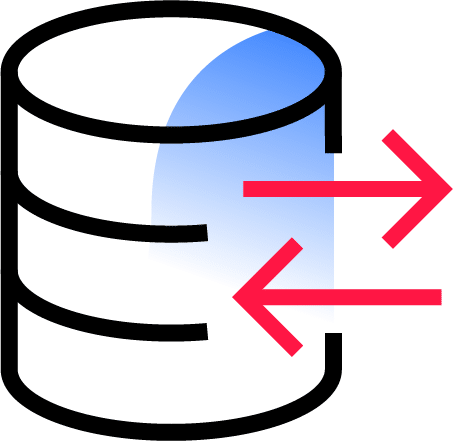

# Participate in and contribute to the Liquibase Community

It takes a lot of people to step up and help to make an open-source project like Liquibase great. 
For over a decade, we’ve had people from around the world participate and contribute in so many ways. Thank you! Here’s how to keep it going and make the community even better.

## See what the community has created

### Database Extensions
* [**Community-maintained databases**](extensions-integrations/directory/database-tutorials/#community-maintained-databases)
* [**Liquibase-maintained databases**](https://docs.liquibase.com/start/tutorials/home.html){:target="_blank"}

### Tool Integrations
* [Ant](extensions-integrations/directory/integration-docs/ant/)
* [GitLab CI/CD](extensions-integrations/directory/integration-docs/gitlab-ci-cd/)
* [Gradle](extensions-integrations/directory/integration-docs/gradle/)
* [JEE CDI](extensions-integrations/directory/integration-docs/jee-cdi/)
* [Servlet Listener](extensions-integrations/directory/integration-docs/servlet-listener/)
* [Spring Boot](extensions-integrations/directory/integration-docs/springboot/)
* [Spinnaker](extensions-integrations/directory/integration-docs/Spinnaker/overview.md)

## Help with Support
{ align="left" width="72" }
Answer questions about Liquibase in Discord, our forum, and StackOverflow.

[Answer Questions](answer/index.md){ .md-button }

## Contribute Content
{ align="left" width="72" }
Share articles and videos about Liquibase, or improvements to documentation

[Contribute Content](write/index.md){ .md-button }

## Be an Advocate
{ align="left" width="72" }
Give a tech talk, share a case study, or amplify Liquibase on social media.

[Be a Liquibase Advocate](advocate/index.md){ .md-button }

## Develop Liquibase
{ align="left" width="72" }
Fix a bug, enhance existing features, or build something completely new.

[Develop Liquibase](code/index.md){ .md-button }

