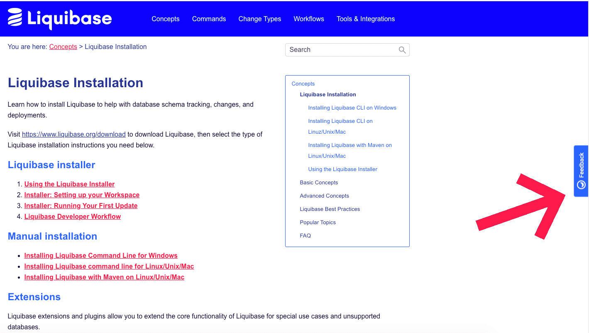

# Improve Liquibase documentation

## How to help improve documentation
Let us know if there are issues with the documentation by providing feedback and corrections.

[Visit Docs](https://docs.liquibase.com){ .md-button }

The [Liquibase Documentation website](https://docs.liquibase.com) allows you to review any documentation topic and submit feedback or corrections quickly and easily so the writing team can make adjustments.

## Where can I find this feature?

This feature can be found on any documentation page throughout the website on the right-hand center of the screen. Just click the feedback button and you’ll enter a tool that captures an image of the screen and provides tools and a form for feedback.

## How do the feedback tools work?

There are several useful tools that allow you to submit feedback:

* **Text**: The text function allows you to highlight a section of the page with a red box, then write a text comment in a bubble beside it.
* **Pen**: The pen function allows you to draw or write directly on the screen capture with a red pen.
* **Arrow**: The arrow function allows you to create arrows so you can point to things.
* **Blackout**: The blackout function allows you to create a black box to cover items you want to signal need removal.

After you have added feedback directly to the screen capture, enter a summary of the issue in the **Title** field of the UserSnap form, followed by a detailed message detailing your feedback (in the **Your message** field). Entering an email (optional) allows you to track of the status of your ticket.

When you have completed your ticket, hit the **SEND** button.

## What happens next?

Your ticket is immediately submitted to the documentation team, where it is sorted, prioritized, and put in the queue to be completed in the next available sprint. Once any work on the ticket is completed and published to the website, the ticket will be closed.